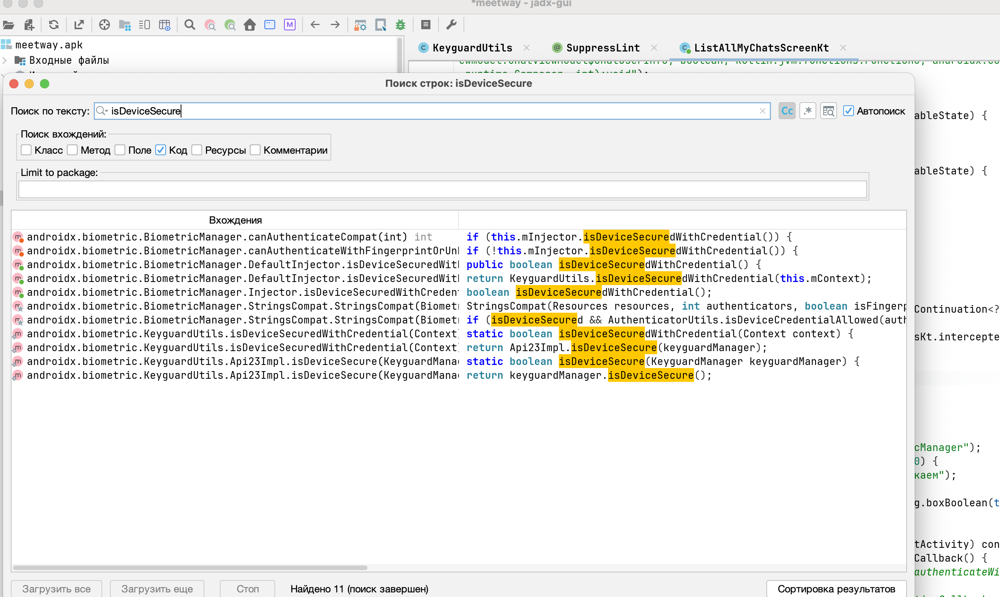

https://mas.owasp.org/MASTG/tests/android/MASVS-RESILIENCE/MASTG-TEST-0247/
# References to APIs for Detecting Secure Screen Lock

тест провожу на приложении 👉 [[0_MeetWay]]

MASTG-TEST-0247

Приложения, которые работают с чувствительными данными (банки, мессенджеры, менеджеры паролей), **обязаны** проверять, защищено ли устройство экранной блокировкой


тест проверяет ли приложение, **установлена ли на устройстве блокировка экрана** (PIN, пароль, графический ключ). Если приложение не проверяет это, а потом пытается использовать биометрию или хранить секреты, это создает риски


-------

нужно в коде найти вызовы данных стандартных апи - которые отвечают за подобный функционал 

делается это поиском стандартных флагов в коде:


1. **проверка наличия блокировки экрана:**
   
    - `isDeviceSecure()` - основной метод для проверки наличия PIN/пароля
    - `isKeyguardSecure()` - аналогичный метод
    - Оба метода относятся к классу `KeyguardManager`
        
2. **проверка доступности биометрии (как косвенная проверка):**
    
    - `canAuthenticate` - метод класса `BiometricManager`. 
    - Он проверяет, готова ли система к биометрической аутентификации, что также подразумевает наличие экранной блокировки


- ==Безопасно:== приложение вызывает `isDeviceSecure()` и, если возвращается `false`, блокирует доступ к важным функциям или требует установить блокировку
   
- ==Небезопасно:== когда эти вызовы в коде отсутствуют

-----------

обнаружил, что в коде используется класс  BiometricManager  из библиотеки androidx.biometric
осталось понять, применяется ли он в приложении или нет





-----------

запускаю llm агента (так как код я писал, то я заранее знаю, где что и как настроено)

--------


Поиск вызовов в JADX поисковике -:
- isDeviceSecure() / isKeyguardSecure() - KeyguardManager
- canAuthenticate() - BiometricManager
- BiometricPrompt - androidx.biometric
- SecurityDetector - дополнительный контекст

### ✅ Найдено в коде

Файл: ListAllMyChatsScreen.kt

**API:** KeyguardManager.isDeviceSecure()  
**Строка:** 460  
**Используется:** ✅ Да - fallback если BiometricManager недоступен

**API:** BiometricManager.canAuthenticate()  
**Строка:** 450-455  
**Используется:** ✅ Да - API 30+, с BIOMETRIC_STRONG | DEVICE_CREDENTIAL

**API:** BiometricPrompt.authenticate()  
**Строка:** 499  
**Используется:** ✅ Да - запрос биометрии перед доступом к чатам

Зависимость в build.gradle.kts:

```
  implementation(libs.androidx.biometric)   ✅
```

Дополнительно: SecurityDetector.kt есть, но он про root/jailbreak (другой тест),
к экранной блокировке отношения не имеет.

Как работает

1. Когда открывается экран списка чатов → LaunchedEffect →
   authenticateWithBiometric(context)
2. На API 30+ → BiometricManager.canAuthenticate() с флагами BIOMETRIC_STRONG |
   DEVICE_CREDENTIAL
3. Если биометрия/PIN не настроена → просто логирует и resume(true) - пускает
   без проверки
4. На API < 30 → KeyguardManager.isDeviceSecure() - если экран не заблокирован →
   тоже resume(true)
5. Если биометрия настроена - вызывает BiometricPrompt и ждёт аутентификацию
6. Если пользователь отменяет/Fail - кидает на first_scrin (логаут)

---------
###  Вывод по тесту MASTG-TEST-0247

**Критерий:** Проверка `isDeviceSecure()` / `KeyguardManager`  
**Результат:** ✅ Есть (fallback для старых API)

**Критерий:** Проверка `BiometricManager.canAuthenticate()`  
**Результат:** ✅ Есть (API 30+)

**Критерий:** Использование `BiometricPrompt`  
**Результат:** ✅ Есть

**Критерий:** Блокировка доступа при отсутствии блокировки  
**Результат:** ❌ НЕТ - код пускает (`resume(true)`)

**Критерий:** Глобальная проверка при старте приложения  
**Результат:** ❌ НЕТ - только на экране чатов

-------

что норм :  приложение корректно использует AndroidX Biometric с правильными
аутентификаторами (BIOMETRIC_STRONG | DEVICE_CREDENTIAL). На устройствах с
настроенной биометрией/PIN – всё работает по OWASP.

не норм -  когда экранная блокировка не установлена, authenticateWithBiometric()
возвращает true и приложение продолжает работу без какой-либо защиты. Здесь я так настроил код в приложении умышленно, для удобства тестирования. в реальности же , при отсутствии блокировки - должно происходить какое-либо запрещающее действие!

Рекомендация: Вместо continuation.resume(true) при отсутствии блокировки экрана
– либо блокировать доступ (редирект на экран с требованием настроить
блокировку), либо хотя бы показывать предупреждение пользователю. Так тест будет
PROPERLY VERIFIED.


