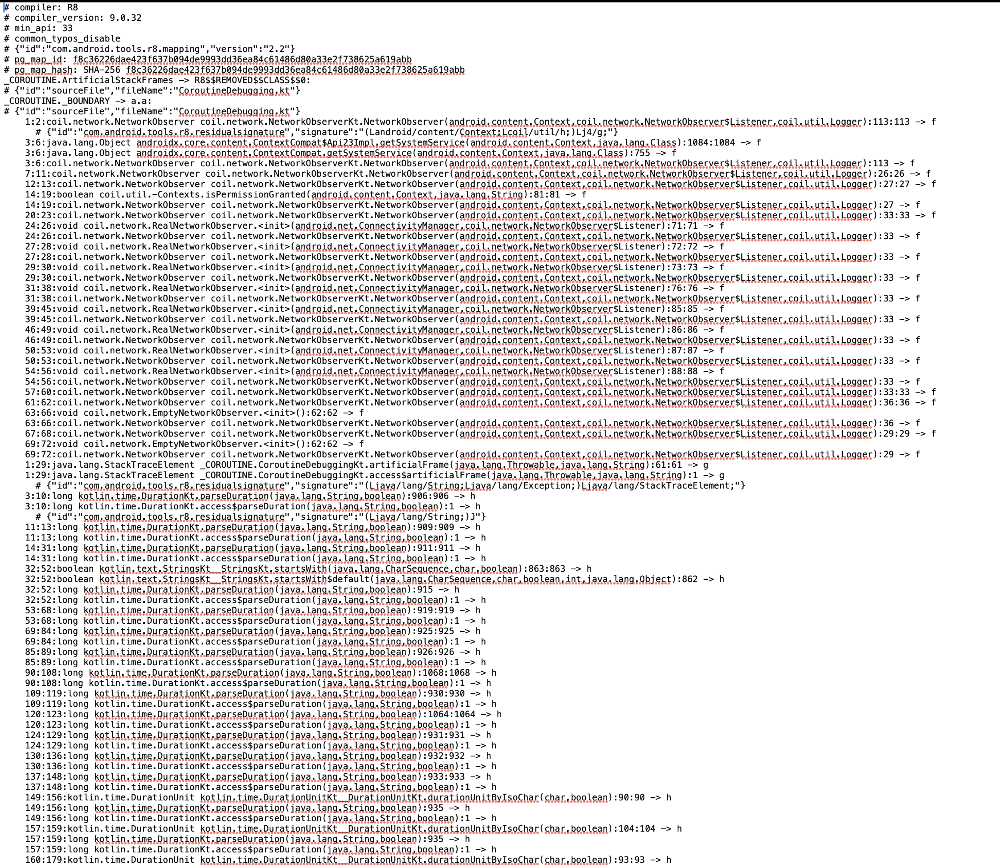
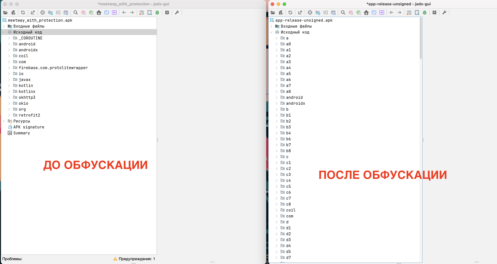
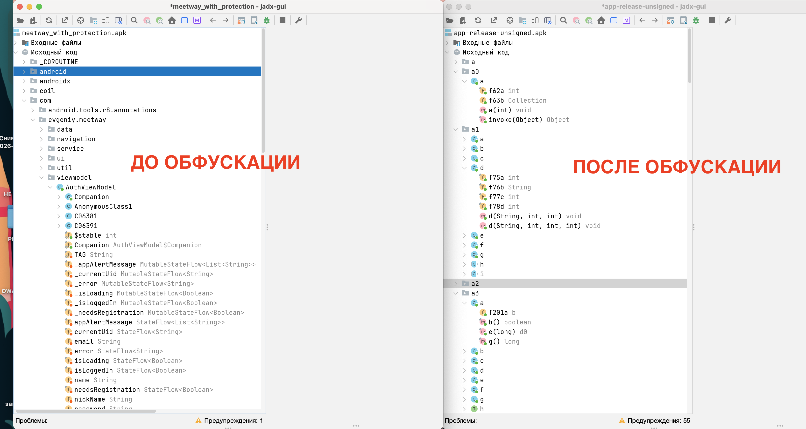
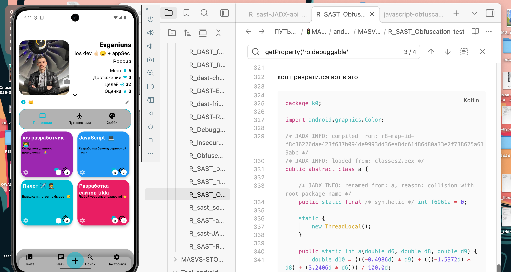

# MASTG-TEST-0368: Insufficient Obfuscation of Security-Relevant Java/Kotlin Code
https://mas.owasp.org/MASTG/tests/android/MASVS-RESILIENCE/MASTG-TEST-0368/

-----

Тест проверяет, может ли злоумышленник, имея декомпилированный код (в JADX), с разумными усилиями понять и восстановить важную для безопасности логику. Если да - тест провален

Речь идет не просто о наличии обфускации, а о том, насколько она эффективна. Даже если имена классов заменены на `a.b.c`, но строки (URL, сообщения, названия проверок) остались открытым текстом, найти нужный код будет несложно. Тест оценивает именно этот баланс!

-----

**Тест ПРОВАЛЕН**, если:

- Имена и строки дают четкое представление о том, что делает код
   
- Логика читается без труда
   

**Тест ПРОЙДЕН**, если:

- Все имена бессмысленны (`a`, `b`, `c`)
   
- Строки зашифрованы или отсутствуют
   
- Логика настолько запутана, что без глубокого анализа не понять, что происходит

-----------

### Уровни обфускации

| Уровень                                                        | Что делает                                                                                                          | Как выглядит в JADX                                                                                                               |
| -------------------------------------------------------------- | ------------------------------------------------------------------------------------------------------------------- | --------------------------------------------------------------------------------------------------------------------------------- |
| **1. Обфускация идентификаторов (Layout Obfuscation)**         | Заменяет понятные имена классов, методов и переменных на короткие, бессмысленные (`a`, `b`, `c`)                    | `MainActivity` превращается в `a`, а метод `checkRoot()` - в `a()`. Читаемость кода резко падает, но логику ещё можно проследить. |
| **2. Обфускация строк (String Obfuscation)**                   | Шифрует или кодирует строковые литералы (URL, ключи, сообщения об ошибках)                                          | Вместо `"https://api.com"` ты видишь вызов `decrypt("x83j2...")`. Искать логику по ключевым словам становится невозможно          |
| **3. Обфускация потока управления (Control Flow Obfuscation)** | Запутывает логику выполнения кода, например, превращая её в огромные `switch`-конструкции (Control Flow Flattening) | Вместо `if/else` ты видишь массив и цикл, который определяет, какой кусок кода выполнять. Понять логику становится очень сложно   |
| **4. Обфускация данных (Data Obfuscation)**                    | Скрывает то, как используются и хранятся данные, например, изменяет порядок переменных или шифрует константы        | Может быть трудно понять, какая переменная за что отвечает и откуда берутся данные.                                               |
| **5. Полиморфная обфускация**                                  | Топовый уровень. Каждая сборка приложения обфусцируется по-разному                                                  | Это значит, что даже если ты разберешь одну версию, следующая будет выгля                                                         |
Если видно только переименование (уровень 1), то это считается недостаточной обфускацией. 
Если есть шифрование строк (уровень 2) и запутанный поток (уровень 3), то обфускация считается эффективной (сказал так ии)

-------

##  запускаю  jadx-gui
```c
jadx-gui ~/Users/evgeniy/Desktop/apk-meetway-с\=защитой-от\=отладки\=и\=взлома/meetway_with_protection.apk
```

весь код читается без проблем!
нигде даже не скрываются имена классов и методов!

обфускация напрочь отсутствует!
тест полный провал!!

---------


### но я пойду дальше и добавлю обфускацию в свое приложение с помощью программы ProGuard/R8 или Obfuscapk

 ProGuard/R8 - не очень, так как дает только базовую защиту "первого уровня"

```
Бесплатный: ✅ 
Встроен в Android SDK / Android Studio / Gradle с коробки. 
Ничего ставить не надо.

Как работает: Оптимизирует, сжимает и обфусцирует Kotlin/Java байткод. Замена имён классов
MainActivity → a, методов checkRoot() → a(), плюс можно строки шифровать через сторонние
плагины (ProGuard сам строки не шифрует, для полного уровня 2 нужно подключать библиотеки
вроде DexGuard — но это платно, или DashO — тоже платно).

 Что умеет ProGuard/R8 по уровням:

┌──────────────────┬─────────────────────────────────────────────────────────────────────┐
│ Уровень          │ ProGuard/R8                                                         │
├──────────────────┼─────────────────────────────────────────────────────────────────────┤
│ 1.               │ ✅ isMinifyEnabled = true — классы → a.b.c, методы → a()            │
│ Идентификаторы   │                                                                     │
├──────────────────┼─────────────────────────────────────────────────────────────────────┤
│ 2. Строки        │ ⚠️ Частично. Сам R8 строки открытые оставляет. Для шифрования строк │
│                  │ нужны плагины (DexGuard — платный). Можно ручной враппер написать   │
├──────────────────┼─────────────────────────────────────────────────────────────────────┤
│ 3. Control Flow  │ ❌ Не умеет. Только ProGuard, не R8.                                │
└──────────────────┴─────────────────────────────────────────────────────────────────────┘

ProGuard/R8 даёт базовую обфускацию (уровень 1)
```
----


```q
┌─────────────┬─────────────────────────┬────────────────┬───────────────────────────────┐
│ Инструмент  │ Цена                    │ Уровни         │ Комментарий                   │
├─────────────┼─────────────────────────┼────────────────┼───────────────────────────────┤
│ ProGuard/R8 │ 🆓 Бесплатно            │ Уровень 1      │ Есть из коробки               │
│             │                         │ (имена)        │                               │
├─────────────┼─────────────────────────┼────────────────┼───────────────────────────────┤
│ Allatori    │ 💰 Платный ($290+)      │ Уровни 1-3     │ Демка есть, но третий раз не  │
│             │                         │                │                      │
├─────────────┼─────────────────────────┼────────────────┼───────────────────────────────┤
│ DexGuard    │ 💰💰💰 Платный           │ 1-5            │ Промышленный стандарт         │
│             │ (~$5000/год)            │                │                               │
├─────────────┼─────────────────────────┼────────────────┼───────────────────────────────┤
│ DashO       │ 💰💰💰 Платный ($5000+)  │ 1-5            │ Топ, но дорого                │
├─────────────┼─────────────────────────┼────────────────┼───────────────────────────────┤
│ ParGuard    │ 🔒 Проприетарный         │ 1-3            │ Есть community edition? Нет   │
├─────────────┼─────────────────────────┼────────────────┼───────────────────────────────┤
│ Obfuscapk   │ 🆓 Бесплатно - старый
│             │   и проблемный, OSS     │ 1-3            │                               │
└─────────────┴─────────────────────────┴────────────────┴───────────────────────────────┘

Obfuscapk - единственная норм бесплатная альтернатива
```


----

что касается ProGuard/R8

нужно добавить 
keep-правила (чтобы не сломать приложение)

Без них - R8 переименует всё подряд, и приложение упадёт (Firebase, Gson, Retrofit
ломаются от переименования)

----

R8 работает просто!
можно просто активировать функцию обфускации!
добавить файлы - которые нужно обфусцировать!
и просто собрать проект!

-----

```q

┌─────────────────────────────────────────┬─────────────────────────────────────┐
│ Файл                                    │ Зачем                               │
├─────────────────────────────────────────┼─────────────────────────────────────┤
│ build.gradle.kts                        │ Главный файл сборки. Тут живёт      │
│ (в глав папке проекта)                  │ вкл/выкл обфускации                 │
├─────────────────────────────────────────┼─────────────────────────────────────┤
│ proguard-rules.pro                      │ Тут ты пишу   правила: что НЕ       │
│                                         │ трогать                             │
├─────────────────────────────────────────┼─────────────────────────────────────┤
│ app/build/outputs/mapping/release/mappi │ Генерируется автоматом - таблица    │
│ ng.txt                                  │ original → obfuscated               │
└─────────────────────────────────────────┴─────────────────────────────────────┘

```

## подключаю обфускацию        ProGuard/R8


иду в файл - android-meetway/app/build.gradle.kts (он в главной папке проекта / app / тут)

там это (и еще куча всего)

```js

  buildTypes {
        release {
            isMinifyEnabled = true 👈✅✅   вот это поставил тру 
            isShrinkResources = true   👈✅✅ добавил это (чтстка мусора)
            proguardFiles(
                getDefaultProguardFile("proguard-android-optimize.txt"),
                "proguard-rules.pro"
            )
        }
    }

```


теперь нужно настроить правила

они в папке тут же 

android-meetway/app/proguard-rules.pro

вот что в файле у меня :

правила обязательны! так как без них все упадет! 
некоторые методы/классы нельзя менять!

```q
# ============================================
# ProGuard / R8 rules for MeetWay
# ============================================

# --- Firebase ---
-keep class com.google.firebase.** { *; }
-keep class com.google.android.gms.** { *; }
-keepattributes Signature

# --- Gson (не ломать модельки) ---
-keepattributes *Annotation*
-keep class com.evgeniy.meetway.data.model.** { *; }
-keep class com.evgeniy.meetway.data.remote.** { *; }
-keepclassmembers class * {
    @com.google.gson.annotations.SerializedName <fields>;
}

# --- Retrofit + OkHttp ---
-keep,allowobfuscation interface retrofit2.** { *; }
-keep class retrofit2.** { *; }
-keepattributes Exceptions
-dontwarn okhttp3.**
-dontwarn okio.**

# --- Compose (не ломать) ---
-keep class androidx.compose.** { *; }

# --- JNI (нативные методы не трогать) ---
-keepclasseswithmembernames class * {
    native <methods>;
}

# --- ViewBinding / DataBinding ---
-keep class * implements androidx.viewbinding.ViewBinding { *; }

# --- Enum (без них краш) ---
-keepclassmembers enum * {
    public static **[] values();
    public static ** valueOf(java.lang.String);
}

# --- Kotlin Coroutines ---
-dontwarn kotlinx.coroutines.**
-keep class kotlinx.coroutines.** { *; }

# --- Serialization ---
-keepclassmembers class * implements java.io.Serializable {
    static final long serialVersionUID;
    private static final java.io.ObjectStreamField[] serialPersistentFields;
    !static !transient <fields>;
    private void writeObject(java.io.ObjectOutputStream);
    private void readObject(java.io.ObjectInputStream);
    java.lang.Object writeReplace();
    java.lang.Object readResolve();
}

# ============================================
# DEBUG: сохранить маппинг и trace
# ============================================
-printmapping mapping.txt
-verbose

```


## теперь пора выполнить сборку c обфускацией


сделал копию проекта для теста
```bash
  cd /Users/evgeniy/Documents/андроид\+обфускация\!\!\ тестовая/android-meetway
```

Собрать release APK с обфускацией:

```bash
  ./gradlew assembleRelease
```

на выходе получаю 2 файла:

```
  app/build/outputs/apk/release/app-release.apk     ← сам APK
  app/build/outputs/mapping/release/mapping.txt     ← таблица переименований
```


запускаю jadx на новый апк с обфускацией

```q
jadx-gui /Users/evgeniy/Documents/андроид\+обфускация\!\!\ тестовая/android-meetway/app/build/outputs/apk/release/app-release-unsigned.apk
```

и вот и сам файл рассшифровка:

/Users/evgeniy/Documents/андроид\+обфускация\!\!\
тестовая/android-meetway/app/build/outputs/mapping/release/mapping.txt

там 200 мб такого:




покажу небольшой кусочек файла расшифровки
методы переименновались в буквы
```q
3:12:int remaining():1962:1962 -> K
    3:12:void skipRawBytes(int):1937 -> K
    13:17:void skipRawBytes(int):1939:1939 -> K
    18:22:void skipRawBytes(int):1944:1944 -> K
    23:27:void skipRawBytes(int):1946:1946 -> K
    1:5:void checkLastTagWas(int):1334:1334 -> a
    6:10:void checkLastTagWas(int):1335:1335 -> a
    1:7:int getTotalBytesRead():1904:1904 -> d
    1:12:boolean isAtEnd():1899:1899 -> e
    1:2:void popLimit(int):1884:1884 -> h
    3:6:void popLimit(int):1885:1885 -> h
    3:7:int pushLimit(int):1870:1870 -> i
    8:11:int pushLimit(int):1871:1871 -> i
    12:13:int pushLimit(int):1875:1875 -> i
    14:17:int pushLimit(int):1877:1877 -> i
    18:22:int pushLimit(int):1873:1873 -> i
    23:27:int pushLimit(int):1868:1868 -> i
    1:14:boolean readBool():1461:1461 -> j
    1:6:com.google.protobuf.ByteString readBytes():1577:1577 -> k
```

----

вот как все теперь выглядит в JADX






код превратился вот в это 

```kotlin
package k0;  
  
import android.graphics.Color;  
  
/* JADX INFO: compiled from: r8-map-id-f8c36226dae423f637b094de9993dd36ea84c61486d80a33e2f738625a619abb */  
/* JADX INFO: loaded from: classes2.dex */  
public abstract class a {  
  
    /* JADX INFO: renamed from: a, reason: collision with root package name */  
    public static final /* synthetic */ int f6961a = 0;  
  
    static {  
        new ThreadLocal();  
    }  
  
    public static int a(double d6, double d8, double d9) {  
        double d10 = (((-0.4986d) * d9) + (((-1.5372d) * d8) + (3.2406d * d6))) / 100.0d;  
        double d11 = ((0.0415d * d9) + ((1.8758d * d8) + ((-0.9689d) * d6))) / 100.0d;  
        double d12 = ((1.057d * d9) + (((-0.204d) * d8) + (0.0557d * d6))) / 100.0d;  
        double dPow = d10 > 0.0031308d ? (Math.pow(d10, 0.4166666666666667d) * 1.055d) - 0.055d : d10 * 12.92d;  
        double dPow2 = d11 > 0.0031308d ? (Math.pow(d11, 0.4166666666666667d) * 1.055d) - 0.055d : d11 * 12.92d;  
        double dPow3 = d12 > 0.0031308d ? (Math.pow(d12, 0.4166666666666667d) * 1.055d) - 0.055d : d12 * 12.92d;  
        int iRound = (int) Math.round(dPow * 255.0d);  
        int iMin = iRound < 0 ? 0 : Math.min(iRound, 255);  
        int iRound2 = (int) Math.round(dPow2 * 255.0d);  
        int iMin2 = iRound2 < 0 ? 0 : Math.min(iRound2, 255);  
        int iRound3 = (int) Math.round(dPow3 * 255.0d);  
        return Color.rgb(iMin, iMin2, iRound3 >= 0 ? Math.min(iRound3, 255) : 0);  
    }  
  
    public static int b(int i9, int i10) {  
        int iAlpha = Color.alpha(i10);  
        int iAlpha2 = Color.alpha(i9);  
        int i11 = 255 - (((255 - iAlpha2) * (255 - iAlpha)) / 255);  
        return Color.argb(i11, c(Color.red(i9), iAlpha2, Color.red(i10), iAlpha, i11), c(Color.green(i9), iAlpha2, Color.green(i10), iAlpha, i11), c(Color.blue(i9), iAlpha2, Color.blue(i10), iAlpha, i11));  
    }  
  
    public static int c(int i9, int i10, int i11, int i12, int i13) {  
        if (i13 == 0) {  
            return 0;  
        }  
        return (((255 - i10) * (i11 * i12)) + ((i9 * 255) * i10)) / (i13 * 255);  
    }  
}
```

и самое удивительное, вся эта каша кода - ЗАПУСТИЛАСЬ!!!! Ахринеть!



