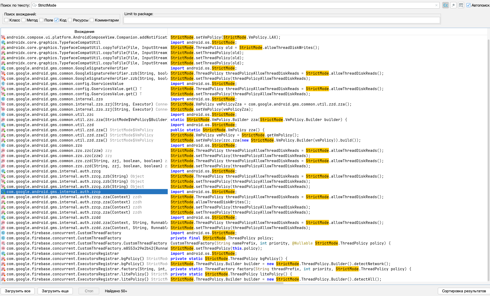
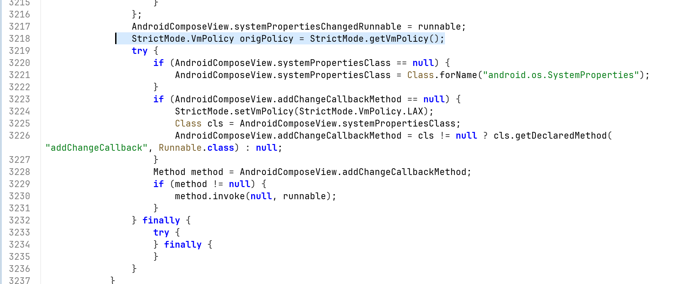

https://mas.owasp.org/MASTG/tests/android/MASVS-RESILIENCE/MASTG-TEST-0265/

тест провожу на приложении 👉 [[0_MeetWay]]
# MASTG-TEST-0265: References to StrictMode APIs

данный тест  проверяет - наличие в коде вызовов методов StrictMode:

- `StrictMode.setThreadPolicy`
    
- `StrictMode.setVmPolicy`
    
- `StrictMode.VmPolicy.Builder.penaltyLog`

тест входит в группу тестов посвященных strict
[[R_dast-check--StrictMode-LOGs]]
[[R_dast-frida-check--StrictMode]]

---------

```q
StrictMode - это инструмент разработчика в Android, который помогает находить проблемы в коде, например, выполнение медленных операций ввода-вывода или сетевых запросов в главном потоке (UI-потоке). Когда StrictMode включен, приложение может логировать такие нарушения, показывать предупреждения или даже крашиться, чтобы разработчик заметил проблему

В продакшн-версии этот режим должен быть выключен, потому что:

1. Он создает лишнюю нагрузку на устройство, замедляя работу приложения
   
2. Логи StrictMode могут содержать детали реализации приложения (например, названия файлов, структуру базы данных, сетевые запросы). Злоумышленник, имеющий доступ к логам устройства (например, через ADB или сторонние приложения для чтения логов), может использовать эту информацию для понимания внутреннего устройства приложения и поиска уязвимостей
```

--------

для выполнения данного теста - я открою apk своего приложения [[0_MeetWay]]
через JADX
и выполню поиск по коду 


------

##  запускаю  jadx-gui
```c
jadx-gui ~/Desktop/meetway.apk
```

через поиск проверяю совпадения в коде:


- `   StrictMode.setThreadPolicy` - основной метод установки политики для потоков.
   
- `StrictMode.setVmPolicy` - основной метод установки политики для виртуальной машины (всего процесса).
   
- `penaltyLog` - метод, который включает логирование нарушений.
   
- `detectAll` - часто используется вместе с `penaltyLog` для включения всех видов проверок.
   
- `StrictMode.ThreadPolicy.Builder` - класс-строитель для настройки политики потоков.
   
- `StrictMode.VmPolicy.Builder` - класс-строитель для настройки политики виртуальной машины.


-------

### результаты проверки:

найдено множество совпадений  StrictMode  в коде







тут можно обратить внимание на этот момент -=- вызов `StrictMode.setVmPolicy(StrictMode.VmPolicy.LAX)`. что временно устанавливает "слабую" политику, которая не будет генерировать нарушения на некоторые действия

Это прямое использование StrictMode API. Это неопровержимое доказательство того, что приложение (с библиотекой Compose) активно использует методы setVmPolicy()и getVmPolicy()
Это и есть цель теста MASTG-TEST-0265

хоть здесь и есть попытки все настроить правильно, все равно - это может привести к утечке логов в будущем


--------

#### вывод - тест провален - так как здесь повсеместно используется StrictMode

проведя динамические тесты на поиск этих самых логов, логов не обнаружил, это хорошо, но само по себе использование StrictMode - уже провал теста, так как в будущем несет риск случайного изменения работы данной части кода которая прячет логи, и тогда возможна утечка данных


