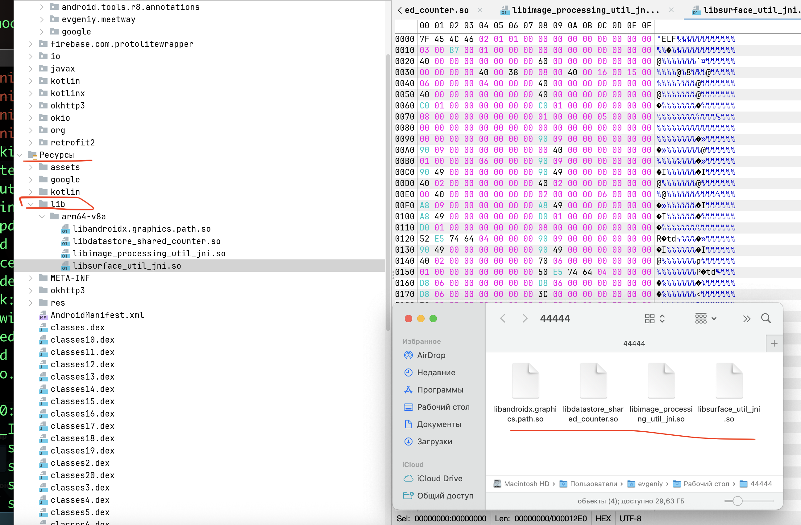

https://mas.owasp.org/MASTG/tests/android/MASVS-RESILIENCE/MASTG-TEST-0288/#evaluation

тест провожу на приложении 👉 [[0_MeetWay]]

# MASTG-TEST-0288: Debugging Symbols in Native Binaries

Задача теста - убедиться, что в продакшн-версии все нативные библиотеки "очищены" от логов Если отладочные символы логов остались - тест провален

Для выполнения этого теста нужен статический анализ самих `.so` файлов, то есть анализ их структуры на наличие отладочных секций

-------

1 - apk файл извлечь (сделаю через jadx)
2- найти там .so файлы и скопировать их
3 - используя утилиту ==readelf== (или ==objdump==) в терминале:


   ==readelf -S имя_библиотеки.so | grep debug==

   Если в выводе нет ни одной строки с ==.debug_*==, значит символы удалены. Если есть - тест провален
   
-------------


##  запускаю  jadx-gui
```c
jadx-gui ~/Desktop/meetway.apk
```

нашел папку lib и в ней файлы расширения .so

экспортировал их в новую папку  44444 на десктоп




теперь проверю все файлы в папке на наличие в них :  `.debug_info`, `.debug_line`

скачаю утилиту binutils
```q
brew install binutils

и добавлю путь к этой проге
echo 'export PATH="/opt/homebrew/Cellar/binutils/2.46.1/bin:$PATH"' >> ~/.zshrc
```

```q

---  сперва сделаю самопроверку (убедюсь, что прога читает нормально сам файл)

readelf -h ~/Desktop/44444/libandroidx.graphics.path.so | grep -i "class"

или вот так:
readelf -S ~/Desktop/44444/libandroidx.graphics.path.so | head -n 20


------------------------------------------------------------------

---- а теперь ищу дебаг символы

cd ~/Desktop/44444
for file in *.so; do
    echo "=== Проверка: $file ==="
    readelf -S "$file" | grep debug
done
```

в выводе нет отладочных символов - тест пройден!

```q
evgeniy@Evgeniys-MacBook-Pro-2 44444 % cd ~/Desktop/44444
for file in *.so; do
    echo "=== Проверка: $file ==="
    readelf -S "$file" | grep debug
done
=== Проверка: libandroidx.graphics.path.so ===
=== Проверка: libdatastore_shared_counter.so ===
=== Проверка: libimage_processing_util_jni.so ===
=== Проверка: libsurface_util_jni.so ===
evgeniy@Evgeniys-MacBook-Pro-2 44444 %v
```


--------

### Отладочные символы в нативных бинарных файлах отсутствуют. Информация о внутреннем устройстве кода не раскрывается. Тест MASTG-TEST-0288 ПРОЙДЕН