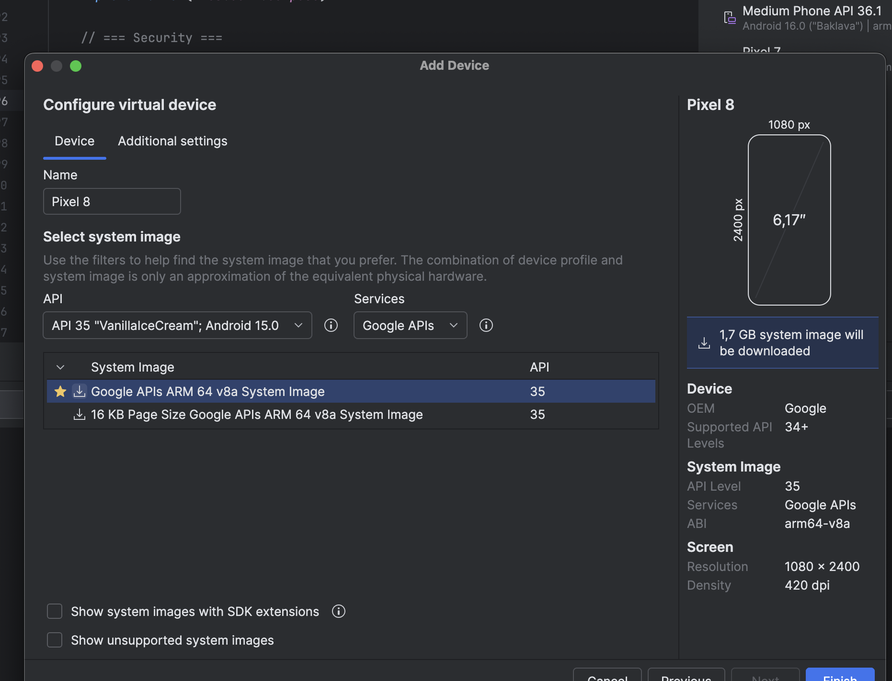

https://mas.owasp.org/MASTG/tests/android/MASVS-RESILIENCE/MASTG-TEST-0351/
# MASTG-TEST-0351: Runtime Use of Emulator Detection Techniques

------
### **использует ли приложение механизмы обнаружения эмулятора во время работы**

Тест проверяет, пытается ли приложение понять, что оно запущено не на реальном устройстве, а в эмуляторе (например, Android Studio Emulator, Genymotion). Это важно для защиты от автоматизированного анализа и реверс-инжиниринга, так как исследователи часто используют эмуляторы для изучения поведения приложения

-----

тест провожу на приложении [[0_MeetWay]]

------

запустил на эмуляторе через андроид студио - приложение запустилось и полноценно работает!
все функции работают, а значит, что как минимум - приложение не препятствует этому!

--------


создаю новый эмулятор - совместимый с моей фридой

иду в андроид студио - view - tool windows - девайс менеджер - создаю новый эмулятор, выбрал  Google APIs ARM 64 v8a System Image API 35 (Google play не подходит - так как там с рут проблема)

```
Packages to install: - Google APIs ARM 64 v8a System Image (system-images;android-35;google_apis;arm64-v8a)


Preparing "Install Google APIs ARM 64 v8a System Image API 35 (revision 9)".
Downloading https://dl.google.com/android/repository/sys-img/google_apis/arm64-v8a-35_r09.zip
```




скачался и установился сам, окей!

далее по шагам:

### 2. Запустить эмулятор (с root-доступом)

```bash
  ~/Library/Android/sdk/emulator/emulator \
    -avd Pixel_8 \
    -writable-system \
    -selinux permissive \
    -no-snapshot-load
```

Эмулятор запустился - не закрывать это окно

### 3. В новом терминале - получить root

```bash
  adb root
  adb shell avbctl disable-verification
  adb reboot
  
  Жду перезагрузки эмулятора (~30 сек)
```


после перезагрузки
### 4. Root + remount

```bash
  adb root
  adb remount

adb shell whoami


```
Должен показать root

### 5. Залить Frida-server на симулятор

```bash
  adb push ~/Downloads/frida-server-17.9.1-android-arm64 /data/local/tmp/
  
  потом 
  
  adb shell chmod 755 /data/local/tmp/frida-server-17.9.1-android-arm64
  
  потом
  
  adb shell "/data/local/tmp/frida-server-17.9.1-android-arm64 &"
  adb forward tcp:27042 tcp:27042
```

### 6. Проверить Frida

```bash
  frida-ps -R
  
  
  -------
  
  evgeniy@Evgeniys-MacBook-Pro-2 ~ % frida-ps -R
 PID  Name
----  ----------------------------------------------------------
1506   Google
1525   Messages
2386   Personal Safety
 994   SIM Toolkit
2714   Settings
3208      adbd
.....
```

есть список процессов - Работает

### 7. Установить MeetWay

```bash
  adb install -t ~/Desktop/meetway.apk
```

приложение появилось в эмуляторе!
### 8. Запустить тест с хуками

СОХРАНЯЮ СКРИПТ

```q
сохраняю скрит для фриды - который будет детектить процессы обнаружения эмулятора!

```q
cat > /Users/evgeniy/Desktop/emulator_detection.js << 'EOF'
Java.perform(function() {
    console.log("[*] === Emulator Detection Hook Script Started ===");

    // --- 1. Перехват чтения системных свойств (System.getProperty) ---
    try {
        var System = Java.use("java.lang.System");
        System.getProperty.overload('java.lang.String').implementation = function(key) {
            var value = this.getProperty(key);
            if (key.indexOf("ro.") !== -1 || key.indexOf("debuggable") !== -1) {
                console.log("[+] System.getProperty() called for key: " + key + " -> value: " + value);
            }
            return value;
        };
        console.log("[+] Hooked: System.getProperty()");
    } catch (e) {
        console.log("[-] Error hooking System.getProperty: " + e);
    }

    // --- 2. Перехват полей Build (основной признак эмулятора) ---
    try {
        var Build = Java.use("android.os.Build");
        var fields = ["FINGERPRINT", "HARDWARE", "MODEL", "PRODUCT", "MANUFACTURER", "BOARD", "DEVICE", "TAGS"];
        fields.forEach(function(field) {
            try {
                var descriptor = Object.getOwnPropertyDescriptor(Build.class, field);
                if (descriptor && descriptor.get) {
                    var originalGetter = descriptor.get;
                    descriptor.get = function() {
                        var value = originalGetter.call(this);
                        console.log("[+] Build." + field + " -> " + value);
                        return value;
                    };
                    Object.defineProperty(Build.class, field, descriptor);
                } else {
                    // Если свойство статическое (доступно напрямую)
                    var value = Build[field].value;
                    console.log("[+] Build." + field + " (static) -> " + value);
                }
            } catch (e) {}
        });
        console.log("[+] Hooked: Build class fields");
    } catch (e) {
        console.log("[-] Error hooking Build: " + e);
    }

    // --- 3. Перехват File.exists() для файлов эмулятора ---
    try {
        var File = Java.use("java.io.File");
        File.exists.implementation = function() {
            var path = this.getPath();
            var result = this.exists();
            var suspiciousPaths = ["qemu", "goldfish", "ranchu", "sdk", "gsi", "generic"];
            for (var i = 0; i < suspiciousPaths.length; i++) {
                if (path.indexOf(suspiciousPaths[i]) !== -1) {
                    console.log("[+] File.exists() called for suspicious path: " + path + " -> " + result);
                    break;
                }
            }
            return result;
        };
        console.log("[+] Hooked: File.exists() for suspicious paths");
    } catch (e) {
        console.log("[-] Error hooking File.exists: " + e);
    }

    // --- 4. Перехват Runtime.exec() для команд, характерных для эмуляторов ---
    try {
        var Runtime = Java.use("java.lang.Runtime");
        Runtime.exec.overload('java.lang.String').implementation = function(command) {
            console.log("[+] Runtime.exec() called with command: " + command);
            if (command.indexOf("qemu") !== -1 || command.indexOf("getprop") !== -1 || command.indexOf("cat /proc/") !== -1) {
                console.log("[!] Potentially emulator-related command executed: " + command);
            }
            return this.exec(command);
        };
        console.log("[+] Hooked: Runtime.exec()");
    } catch (e) {
        console.log("[-] Error hooking Runtime.exec: " + e);
    }

    // --- 5. Перехват PackageManager для поиска эмуляторных приложений (редко) ---
    try {
        var PackageManager = Java.use("android.content.pm.PackageManager");
        PackageManager.getPackageInfo.overload('java.lang.String', 'int').implementation = function(packageName, flags) {
            var suspiciousPackages = ["com.android.vending", "com.google.android.gms"]; // На эмуляторе их может не быть
            if (suspiciousPackages.indexOf(packageName) !== -1) {
                console.log("[+] PackageManager.getPackageInfo() called for: " + packageName);
            }
            return this.getPackageInfo(packageName, flags);
        };
        console.log("[+] Hooked: PackageManager.getPackageInfo()");
    } catch (e) {
        console.log("[-] Error hooking PackageManager: " + e);
    }

    console.log("[*] === All emulator detection hooks are set. Waiting for events... ===");
});
EOF
```

ЗАПУСКАЮ

```bash
  frida -R -f com.evgeniy.meetway -l /Users/evgeniy/Desktop/emulator_detection.js
```


приложение запустилось!
прекрасно работает!

скрипт фриды не находит методов детекции эмулятора!

хуки не сработали! не находят ничего!
и приложеиние без проблем работает!!


![[Снимок2026-07-0100.14.31.png]]

------

### Вывод по тесту:

- ❌ Анти-эмулятор - не обнаружен. Приложение спокойно работает на эмуляторе (Google APIs
  / userdebug)

фрида не обнаружила методы связанные с детектом эмулятора!!

### тест провален, нет защиты детект эмулятора