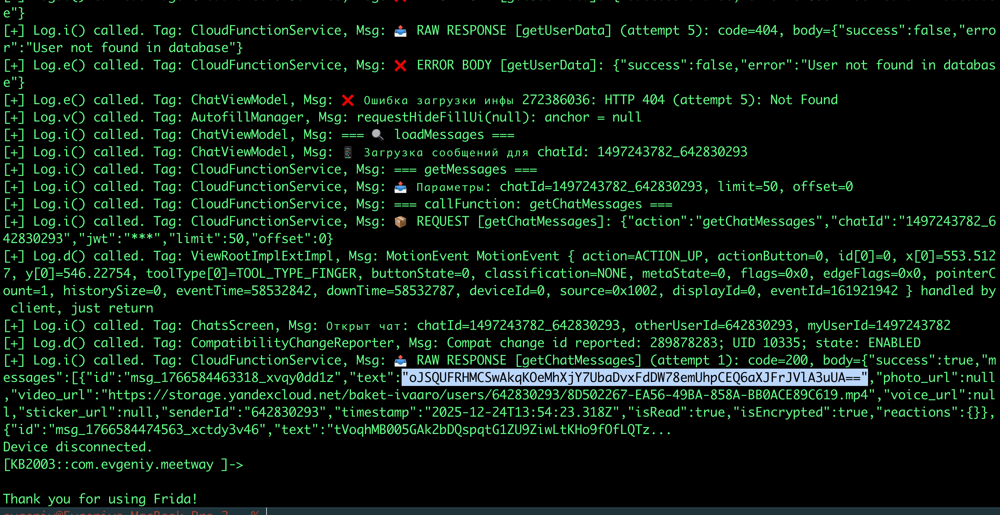
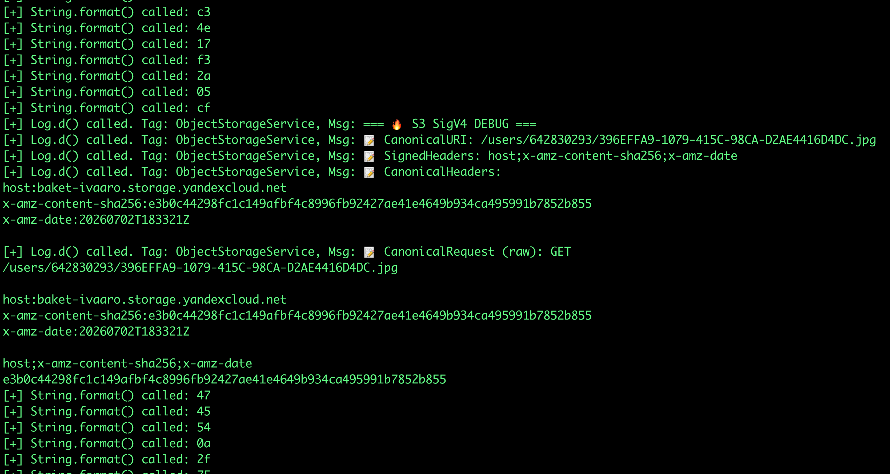
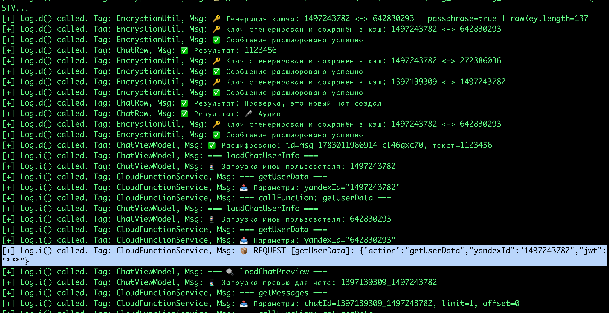

# MASTG-TEST-0203: Runtime Use of Logging APIs
https://mas.owasp.org/MASTG/tests/android/MASVS-STORAGE/MASTG-TEST-0203/

**не использует ли приложение логи для записи чувствительных данных**

------

Этот тест проверяет, не записывает ли приложение в системный лог (`logcat`) чувствительную информацию (пароли, токены, личные данные). Логи доступны многим приложениям и инструментам, и утечка через них -  одна из самых частых уязвимостей!!!!!!

----------

тест на приложении [[0_MeetWay]]

-----

задача : 

 **написать - Frida-скрипт**, который будет перехватывать следующие методы:

- `Log.v()`, `Log.d()`, `Log.i()`, `Log.w()`, `Log.e()`, `Log.wtf()` - все методы класса `android.util.Log`
   
- `System.out.print()` и `System.err.print()` - вывод в стандартный поток
   
- `Throwable.printStackTrace()` - печать стека ошибок
   
- Любые другие кастомные методы логирования, которые ты можешь найти в коде
   

Скрипт должен логировать (выводить в консоль Frida) текст сообщения, которое приложение пытается записат

--------

**Тест провален:** ЕСЛИ В  логах обнаружены чувствительные данные (например, токен авторизации, пароль в открытом виде)

------

фрида везде стоит уже

```q
кидаю shell телефона

adb shell
su

запускаю сервер фриды на телефоне

cd /data/local/tmp
chmod 755 frida-server-17.9.1-android-arm64
nohup ./frida-server-17.9.1-android-arm64 &


НА МАКЕ В НОВОМ ТЕМИНАЛЕ 

// кидаю порт
adb forward tcp:27042 tcp:27042

смотрю запущенные процессы

frida-ps -U

```

скрипт фрида

```q

cat > /Users/evgeniy/Desktop/log_hook.js << 'EOF'


// log_hook.js - Universal Logging API Hook Script
Java.perform(function() {
    console.log("[*] === Logging API Hook Script Started ===");

    // 1. Перехват android.util.Log
    try {
        var Log = Java.use("android.util.Log");
        var logLevels = ["v", "d", "i", "w", "e", "wtf"];
        logLevels.forEach(function(level) {
            Log[level].overload('java.lang.String', 'java.lang.String').implementation = function(tag, msg) {
                console.log("[+] Log." + level + "() called. Tag: " + tag + ", Msg: " + msg);
                if (msg && (msg.indexOf("password") !== -1 || msg.indexOf("token") !== -1 || msg.indexOf("key") !== -1 || msg.indexOf("secret") !== -1)) {
                    console.log("[!] SENSITIVE DATA LOGGED: " + msg);
                }
                return this[level](tag, msg);
            };
        });
        console.log("[+] Hooked: android.util.Log (v, d, i, w, e, wtf)");
    } catch(e) { console.log("[-] Error hooking Log: " + e); }

    // 2. Перехват System.out.println (и других выводов в консоль)
    try {
        var System = Java.use("java.lang.System");
        var PrintStream = Java.use("java.io.PrintStream");
        var out = System.out.value;
        var err = System.err.value;

        PrintStream.println.overload('java.lang.String').implementation = function(str) {
            if (str) {
                console.log("[+] System.out/err.println() called: " + str);
                if (str.indexOf("password") !== -1 || str.indexOf("token") !== -1 || str.indexOf("key") !== -1 || str.indexOf("secret") !== -1) {
                    console.log("[!] SENSITIVE DATA PRINTED: " + str);
                }
            }
            return this.println(str);
        };
        console.log("[+] Hooked: System.out.println() and System.err.println()");
    } catch(e) { console.log("[-] Error hooking System.out: " + e); }

    // 3. Перехват Throwable.printStackTrace()
    try {
        var Throwable = Java.use("java.lang.Throwable");
        Throwable.printStackTrace.implementation = function() {
            console.log("[+] Throwable.printStackTrace() called.");
            console.log("[+] Stack trace:\n" + Java.use("android.util.Log").getStackTraceString(this));
            this.printStackTrace();
        };
        console.log("[+] Hooked: Throwable.printStackTrace()");
    } catch(e) { console.log("[-] Error hooking Throwable: " + e); }

    // 4. Дополнительно: перехват String.format (часто используется в логах)
    try {
        var String = Java.use("java.lang.String");
        String.format.overload('java.lang.String', '[Ljava.lang.Object;').implementation = function(format, args) {
            var result = this.format(format, args);
            console.log("[+] String.format() called: " + result);
            return result;
        };
        console.log("[+] Hooked: String.format()");
    } catch(e) { console.log("[-] Error hooking String.format: " + e); }

    console.log("[*] === All logging hooks are set. Monitoring for sensitive data... ===");
});


EOF

```

запуск приложения со скриптом!!

```q
frida -U -f com.evgeniy.meetway -l /Users/evgeniy/Desktop/log_hook.js
```

РЕЗУЛЬТАТЫ ТЕСТА!

-----------

----


находок много!










------

### анализ всех находок

прошёлся по всем логам от фриды и нашёл несколько проблем. разбил по уровням критичности

----

## 🔴 КРИТИЧЕСКИЕ утечки (данные пользователя в открытом виде)

### 1. Email в логах
```
Log.i() tag=CloudFunctionService Msg: RAW RESPONSE [getUserData]:
..."email":"soap222222@yandex.ru"...
```
адрес электронной почты пользователя утекает в `Log.i()` - то есть в info-логи, которые видны всем

☠️🔴☠️ (критично, так как в приложении просто так никто не может видеть чужой емайл)

**где:** CloudFunctionService.kt - логирование RAW RESPONSE от сервера

### 2. Полный профиль пользователя
через `Log.i()` выводится ВЕСЬ объект `UserProfileData` - имя, email, аватар, профессия, страна, города, хобби, цели, ачивки, рейтинг, жалобы, статус аккаунта

это не просто чувствительные данные - это PII (персональные данные), которые по 152-ФЗ и GDPR должны быть защищены

**проблема:** в логах видно даже `countComplaint`, `allidComplaintUsers` - количество жалоб и список ID тех кто жаловался. это уже внутренняя логика приложения


----

## 🟡 ВЫСОКАЯ угроза (внутренние ID и метаданные)

### 5. yandex_id / uid в каждом логе
```
Log.i() tag=CloudFunctionService Msg: Параметры: yandexId="1497243782"
```
**везде** логируется yandex_id пользователя. каждый запрос - новый лог с ID. этого достаточно для профилирования активности

 этот ай ди сам по себе как ник просто 
 но упрощает взлом

### 6. S3 SigV4 DEBUG логи
```
Log.d() tag=ObjectStorageService Msg: === S3 SigV4 DEBUG ===
Log.d() Msg: CanonicalURI: /users/1497243782/DE049160-...
Log.d() Msg: SignedHeaders: host;x-amz-content-sha256;x-amz-date
Log.d() Msg: StringToSign: AWS4-HMAC-SHA256...
```
хоть сами access keys не выводятся, но полная структура подписи AWS SigV4 утекает. это упрощает реверс-инжиниринг S3 клиента

### 7. URL аватарок с S3
```
..."avatar":"https://storage.yandexcloud.net/baket-ivaaro/users/1497243782/..."...
```
полный путь к файлам в S3 - зная структуру бакета легче атаковать
☠️🔴☠️ опасно! так как тут показаны пути к серверу!

### 8. ID чатов и структура базы
```
chatId=1497243782_642830293, limit=1, offset=0
```
в логах видно как называются поля в JSON, какие параметры передаются, какая структура данных на сервере

----

## 🟠 СРЕДНЯЯ угроза (метаданные шифрования)

### 9. Детали расшифровки сообщений
```
Log.d() tag=EncryptionUtil Msg: Генерация ключа: 1497243782 <-> 642830293 | passphrase=true | rawKey.length=137
Log.d() tag=ChatRow Msg: Текст (первые 50): Алё, приём 
```
- длина ключа шифрования (rawKey.length)
- длина зашифрованного сообщения
- первые 50 символов зашифрованного текста
- флаг passphrase - злоумышленник знает что используется passphrase

для одного из сообщений расшифрованный текст попал в лог через `Log.d()`:
```
Текст (первые 50): Алё, приём 
Результат: 1123456
Результат: Проверка, это новый чат создал
```
это означает что содержимое сообщений (пусть и не всех) может утекать
☠️🔴☠️ можно понять полностью - как работает шифрование и расшифровать всю систему

### 10. JWT длина
```
Log.d() Msg: JWT загружен: найден, длина=285
```
☠️🔴☠️ сам токен не выводится, но факт его наличия и длина известны

----

## 🔵 НИЗКАЯ угроза (информационные)

### 11. Debug логи S3 сигнатуры
```
Log.d() tag=ObjectStorageService Msg: CanonicalRequest (bytes): 47 45 54 0a 2f 75...
```
байтовое представление запроса - избыточные debug-логи которые не нужны в релизе


----

----

### вывод по тесту MASTG-TEST-0203

**❌ ТЕСТ ПРОВАЛЕН**

приложение активно использует логи (`Log.i()`, `Log.d()`) и в них попадают:
- персональные данные (email, имя, профессия, город)
- данные других пользователей
- внутренние ID и структура БД
- детали S3/AWS подписей
- метаданные шифрования (длина ключа, passphrase)
- расшифрованный текст сообщений


**рекомендации:**
1. убрать все логи вообще ! нахрен! только дебаг оставить если нужно, но в релиз ничего не должно идти!

----

