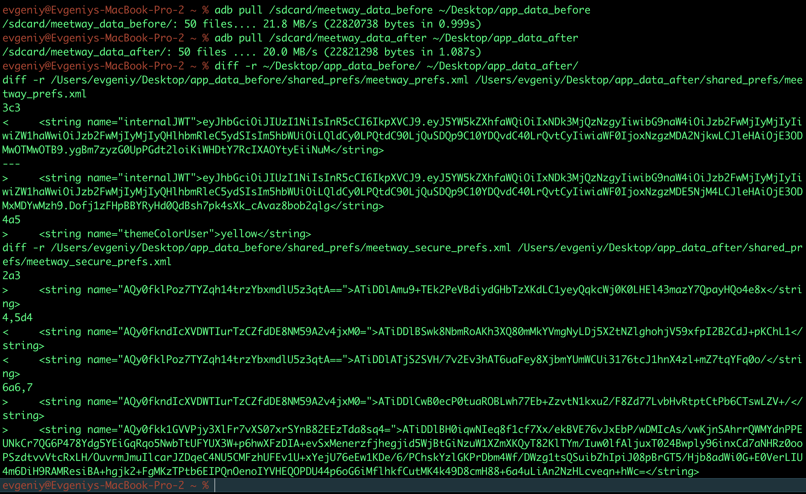

# MASTG-TEST-0216: Sensitive Data Not Excluded From Backup
https://mas.owasp.org/MASTG/tests/android/MASVS-STORAGE/MASTG-TEST-0216/

--------

## **не попадают ли чувствительные данные приложения в резервную копию (Android Backup)**


## ЕСЛИ в манифесте стоит android:allowBackup="false"  - это значит
##  бэкап выключен целиком. тест проходит автоматом


----

тест проводится следующим образом:

в файле манифеста 

- есть ли android:allowBackup="true" или android:fullBackupContent="true"
- если allowBackup включён - андроид сам делает бэкап всех файлов приложения в
  облако (Google Drive)
- если нет android:dataExtractionRules - то старый Auto Backup бэкапит вообще всё
  подряд: shared_prefs, databases, files, cache

------

и сам тест проводить нужно все равно так:

Делаем реальный бэкап и смотрим что внутри

```bash
  # создаём бэкап
  adb backup -f meetway.ab -apk -noshared com.evgeniy.meetway

  # конвертируем .ab в .tar (через python)
  dd if=meetway.ab bs=1 skip=24 | python -c "import
zlib,sys;sys.stdout.buffer.write(zlib.decompress(sys.stdin.buffer.read()))" >
meetway.tar

  # распаковываем
  tar xf meetway.tar

  # смотрим что внутри – ищем JWT, токены, ключи
  grep -r "internalJWT\|token\|password\|secret" apps/com.evgeniy.meetway/
```

если в бэкапе нашлись чувствительные данные - тест провален

---

 Смотрим файл backup_rules.xml

в проекте обычно есть файл res/xml/backup_rules.xml - если там не перечислены
исключения для чувствительных файлов, то они попадут в бэкап

-------


-----


смотрю манифест

android-meetway/app/src/main/AndroidManifest.xml


вот весь файл маниыеста 

```q
**<?xml version=**"1.0" **encoding=**"utf-8"**?>**

**<manifest** xmlns**:**android**=**"http://schemas.android.com/apk/res/android"

    xmlns**:**tools**=**"http://schemas.android.com/tools"**>**

  

    <!-- Permissions -->

    **<uses-permission** android**:**name**=**"android.permission.INTERNET" **/>**

    **<uses-permission** android**:**name**=**"android.permission.ACCESS_NETWORK_STATE" **/>**

    **<uses-permission** android**:**name**=**"android.permission.CAMERA" **/>**

    **<uses-feature** android**:**name**=**"android.hardware.camera" android**:**required**=**"false" **/>**

    **<uses-feature** android**:**name**=**"android.hardware.camera.autofocus" android**:**required**=**"false" **/>**

    **<uses-permission** android**:**name**=**"android.permission.RECORD_AUDIO" **/>**

    **<uses-permission** android**:**name**=**"android.permission.VIBRATE" **/>**

    **<uses-permission** android**:**name**=**"android.permission.POST_NOTIFICATIONS" **/>**

    **<uses-permission** android**:**name**=**"android.permission.READ_EXTERNAL_STORAGE"

        android**:**maxSdkVersion**=**"32" **/>**

    **<uses-permission** android**:**name**=**"android.permission.READ_MEDIA_IMAGES" **/>**

  

    **<application**

        android**:**name**=**".MeetWayApp"


вот ОНО

        🔥🟢✅🚦 android**:**allowBackup**=**"false"  👈🔥🟢✅🚦👈🔥🟢✅🚦👈🔥🟢✅🚦


ВОТ Оно
ЗНАЧИТ - БЕКАП НЕ ДОЛЖЕН ВОБЩЕ СОЗДАВАТЬСЯ!

        android**:**dataExtractionRules**=**"@xml/data_extraction_rules"

        android**:**fullBackupContent**=**"@xml/backup_rules"

        android**:**icon**=**"@mipmap/ic_launcher"

        android**:**label**=**"@string/app_name"

        android**:**roundIcon**=**"@mipmap/ic_launcher_round"

        android**:**supportsRtl**=**"true"

        android**:**theme**=**"@style/Theme.MeetWay"

        android**:**networkSecurityConfig**=**"@xml/network_security_config"

        tools**:**targetApi**=**"36"**>**

        <!-- Yandex OAuth Redirect (запасной вариант) -->

        **<activity**

            android**:**name**=**".AuthRedirectActivity"

            android**:**exported**=**"true"

            android**:**theme**=**"@style/Theme.MeetWay"**>**

            **<intent-filter>**

                **<action** android**:**name**=**"android.intent.action.VIEW" **/>**

                **<category** android**:**name**=**"android.intent.category.DEFAULT" **/>**

                **<category** android**:**name**=**"android.intent.category.BROWSABLE" **/>**

                <!-- Кастомная схема: yx547697fe6e9d46ea9a7e538922d1425d://auth -->

                **<data**

                    android**:**scheme**=**"yx547697fe6e9d46ea9a7e538922d1425d"

                    android**:**host**=**"auth" **/>**

            **</intent-filter>**

        **</activity>**

  

        <!-- Yandex OAuth WebView (основной вариант – перехват редиректа внутри приложения) -->

        **<activity**

            android**:**name**=**".YandexAuthWebViewActivity"

            android**:**exported**=**"false"

            android**:**theme**=**"@style/Theme.MeetWay" **/>**

  

        **<activity**

            android**:**name**=**".MainActivity"

            android**:**exported**=**"true"

            android**:**label**=**"@string/app_name"

            android**:**theme**=**"@style/Theme.MeetWay"

            android**:**windowSoftInputMode**=**"adjustResize"**>**

            **<intent-filter>**

                **<action** android**:**name**=**"android.intent.action.MAIN" **/>**

                **<category** android**:**name**=**"android.intent.category.LAUNCHER" **/>**

            **</intent-filter>**

        **</activity>**

  

        <!-- FCM Push Messaging Service -->

        **<service**

            android**:**name**=**".service.MeetWayMessagingService"

            android**:**exported**=**"false"**>**

            **<intent-filter>**

                **<action** android**:**name**=**"com.google.firebase.MESSAGING_EVENT" **/>**

            **</intent-filter>**

        **</service>**

  

        <!-- BroadcastReceiver для действий push-уведомлений (iOS: UNNotificationAction) -->

        **<receiver**

            android**:**name**=**".service.MeetWayMessagingService$NotificationActionReceiver"

            android**:**exported**=**"false"**>**

            **<intent-filter>**

                **<action** android**:**name**=**"REPLY_ACTION" **/>**

                **<action** android**:**name**=**"MARK_AS_READ" **/>**

            **</intent-filter>**

        **</receiver>**

    **</application>**

  

**</manifest>**
```

----

## продолжаю = создаю резерв копию данных

```q

adb shell
OnePlus8T:/ $ su

в новом терминале 

 # создаём бэкап
adb backup -f meetway.ab -apk -noshared com.evgeniy.meetway

в телефоне подтвердил создание копии!
```

```bash
  # конвертируем .ab в .tar (одной строкой!)
  dd if=meetway.ab bs=1 skip=24 | python3 -c "import zlib,sys;sys.stdout.buffer.write(zlib.decompress(sys.stdin.buffer.read()))" > meetway.tar

  # распаковываем
  tar xf meetway.tar

  # смотрим что внутри – ищем JWT, токены, ключи
  grep -r "internalJWT\|token\|password\|secret" apps/com.evgeniy.meetway/
```

-------
в выводе бекапа - вижу оч много падарков!




----


### что нашли в бэкапе

внутри бэкапа (даже при `allowBackup=false`) оказались:
- `shared_prefs/meetway_prefs.xml` - JWT токен в открытом виде (`internalJWT`)
- `shared_prefs/meetway_secure_prefs.xml` - зашифрованные данные
- `files/`, `cache/` - временные файлы, медиа

grep подтвердил что JWT и токены в бэкапе есть. причина - JWT дублируется в обычные SharedPreferences (баг портирования с iOS)

----

### проверка backup_rules.xml и data_extraction_rules.xml

```xml
<!-- backup_rules.xml – пустой, всё закомментировано -->
<full-backup-content>
    <!--
    <include domain="sharedpref" path="."/>
    <exclude domain="sharedpref" path="device.xml"/>
    -->
</full-backup-content>
```

```xml
<!-- data_extraction_rules.xml – тоже пустой, всё TODO -->
<data-extraction-rules>
    <cloud-backup>
        <!-- TODO: Use <include> and <exclude> -->
    </cloud-backup>
</data-extraction-rules>
```

оба файла пустые - если кто-то переключит `allowBackup` на `true`, всё содержимое приложения (включая JWT) улетит в Google Drive без каких-либо исключений

----

### итоговый вывод по тесту MASTG-TEST-0216

**✅ ТЕСТ ПРОЙДЕН**

в манифесте стоит `android:allowBackup="false"` - автоматический бэкап в Google Drive отключён. чувствительные данные не утекут в облако

дополнительно:
- `backup_rules.xml` и `data_extraction_rules.xml` пустые, но это неважно - allowBackup=false их отключает
- `adb backup` это ручная утилита разработчика, к тесту MASVS не относится

**рекомендация:** если когда-нибудь allowBackup переключат на true - не забыть добавить exclude для meetway_prefs.xml

### allowBackup="false" - бэкап выключен целиком. не будет никаких автоматических копий ни в Google
Drive, ни при смене устройства.

