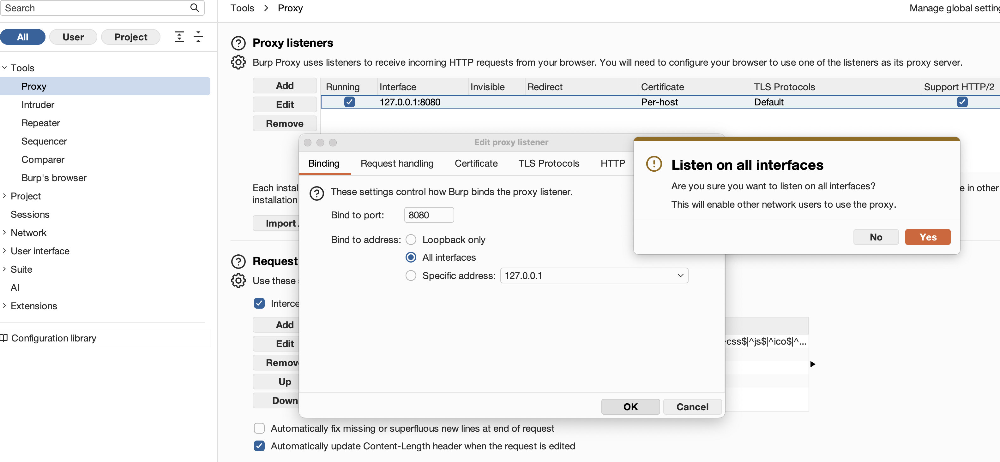

на андроид 14 система очень сильно сопротивляется перехвату
именно - сам андроид гугла

-------
образец тут [[P_dast-burp_данные-не-указанные-в-политике]]


готовлю бупр




теперь нужно поставить на телефон ip мака в сети wifi общего (или так - ifconfig)

мой телефон onePlus8t android 14

настройки в телефоне - wifi - мой подключенный wifi - i (настройка)
настройка прокси - вручную - сервер - указать там ip wifi
порт 8080 - сохранить

в браузер перехожу http://192.168.0.15:8080

после чего - скачать на телефон и установить сертификат burp

он скачался в загрузки и от туда не устанавливается

нужно установить сертификат в системное хранилище (`System`). Это требует root-прав, и у меня есть Magisk

------

план такой - подготовить сертификат на ноуте, потом закинуть его в телефон - в системные файлы - и там его установить!

делее проверить, что трафик течет через burp моего ноута!

--------

**Подготовка сертификата на Mac**

```bash
# Перейти в папку с загрузками
cd ~/Downloads

# 1. Скачать сертификат Burp в DER-формате 
# wget http://192.168.0.105:8080/cert -O cacert.der

# 2. Конвертир DER в PEM
openssl x509 -inform DER -in cacert.der -out cacert.pem

# 3. Получить хеш для имени файла
CERT_HASH=$(openssl x509 -inform PEM -subject_hash_old -in cacert.pem | head -1)
echo $CERT_HASH

# 4. Переименять файл в <хеш>.0
mv cacert.pem $CERT_HASH.0

```


кинуть этот файл на телефон

```sh
adb push $CERT_HASH.0 /sdcard/Download/
```


**Установить сертификат в систему через Magisk**

```shell
adb shell
su

# заменить 9a5ba575.0 на хеш, который я получил
CERT_NAME="9a5ba575.0"  # <-- ПОДСТАВИТЬ  ХЕШ
MODULE_NAME="burp_cert"

# папка для модуля Magisk
cd /data/adb/modules/
mkdir -p "$MODULE_NAME/system/etc/security/cacerts/"

# копир системные сертификаты в модуль
cp /system/etc/security/cacerts/* "$MODULE_NAME/system/etc/security/cacerts/"

# копир сертификат Burp в модуль
mv "/sdcard/Download/$CERT_NAME" "$MODULE_NAME/system/etc/security/cacerts/"

# правильные права
cd "$MODULE_NAME/system/etc/security/cacerts/"
chown root:root $CERT_NAME
chmod 644 $CERT_NAME

# Выход из shell
exit
exit

# Перезагружаем мобилку
adb reboot

снова ставлю прокси

WiFi → моя сеть → настройка → прокси вручную:
- Сервер: 192.168.0.11
- Порт: 8080
```

и наконец, проверить установку

После перезагрузки зайти в `Настройки` -> `Безопасность и конфиденциальность` -> `Другие настройки безопасности` -> `Доверенные учетные данные` -> вкладка `Система` (System)

должен буду увидеть там сертификат `PortSwigger CA`

все работает!

трафик с телефона пошел через мой бупр!


