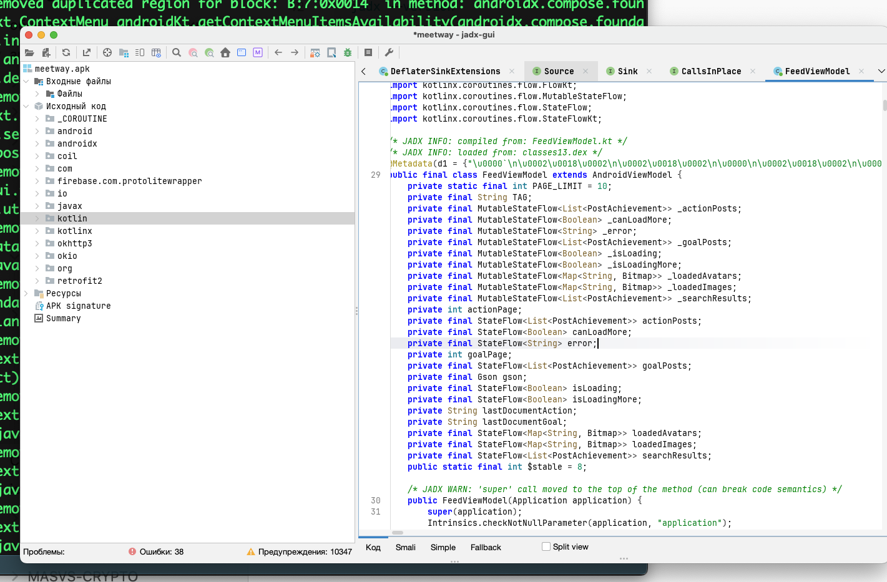

## JADX-GUI -  декомпилятор  для андроид приложений - топ инструмент для чтения исходного кода

------

# разница между ios / android

### На iOS:

- Бинарник в IPA зашифрован Apple FairPlay
   
- Нужно: или с джейлбрейкнутого устройства дампить память (frida-ios-dump), или с Mac вытаскивать через ipa
   
- Потом бинарник в IDA/Ghidra/Radare2
   

### На Android:

- **Никакого шифрования** от производителя
   
- APK - это тупо zip-архив с байт-кодом Dalvik (classes.dex)
   
- Этот байт-код превращается в Java-код почти полностью
   
- Если есть обфускация - видно `a.b.c`, но логику восстановить можно


чтобы смотреть код андроид приложения, достав apk файл - есть инструмент  JADX-GUI  - работает прямо с APK и дает deobfuscator, можно сказать, лучшая тулза для реверс андроида

но можно и достать DEX и пойти в Radare2, так я делал при тестировании iOS^ но смысла нет, так как JADX сделает лучше!

-----------


## установка на мак JADX-GUI 

```q

//Ставим jadx
brew install jadx

//Проверяем (у меня 1.5.5)
jadx --version

//JADX требует Java 11 или выше (у меня 17.0.18)
// поэтому
java -version


-------------
либо на крайняк можно вручную скачать jadx и распаковать
curl -L -o jadx.zip https://github.com/skylot/jadx/releases/latest/download/jadx-1.5.0.zip
```


----------

##  запускаю  jadx-gui
```c
jadx-gui ~/Desktop/meetway.apk
```

и получаю на первый взгляд - вообще полный доступ к коду!!!
афигеть.. в ios такого не бывает )




-----------------


