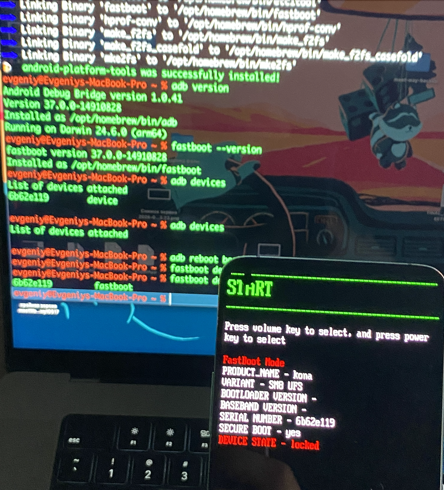
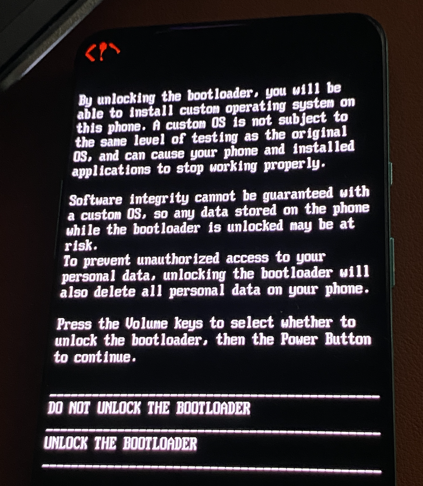
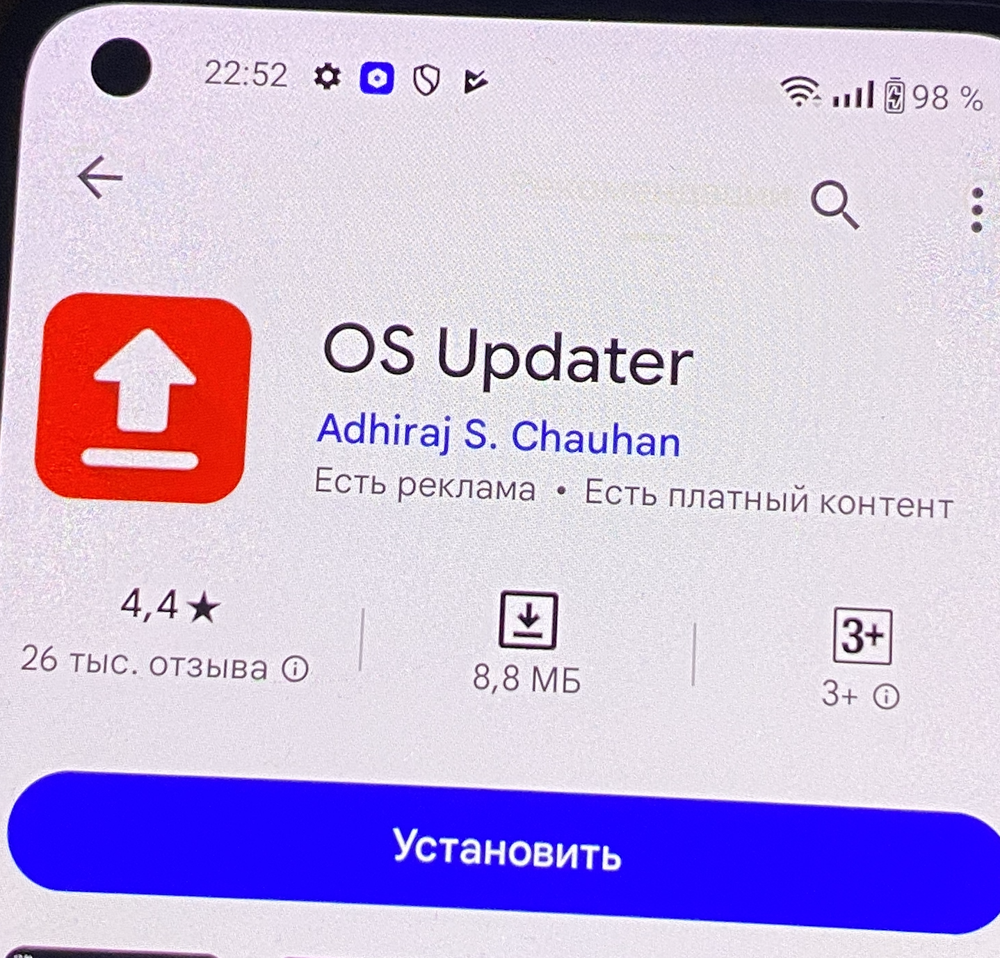
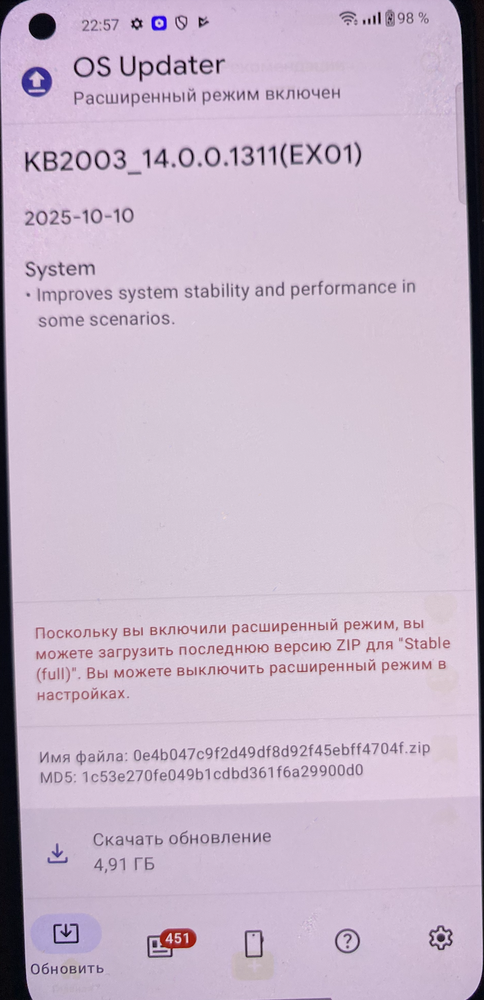

```q
# shell телефона
adb shell
su
```

подготовка телефона - как инструмент для тестов


взял для этих целей onePlus 8T   KB2003
у меня мак

----------

### Установка ADB и Fastboot

```q
brew install android-platform-tools

-----------

adb version
fastboot --version
```

--------------

### Подготовка телефона

1 - вкл реж разработчика (7 нажатий на номер сборки) 

2 - OEM-разблокировка - ВКЛ
   
3 - Отладка по USB - ВКЛ

##### далее в терминале на мак

```q
(кабель подключен)
adb devices

вижу 
6b62e119	device

это и есть мой телефон
```


--------------

## Разблокировка загрузчика (Bootloader) 
удалятся все данные на телефоне

```q
# Ребут в загрузчик (fastboot)
adb reboot bootloader

# Теперь ты в fastboot. Проверь, что видно устройство:
fastboot devices


```

вижу




```q
# Отдаем команду на разблокировку
fastboot oem unlock
```

вижу




выбираю "UNLOCK THE BOOTLOADER"  кнопкой громкости - подтверждаю кнопкой питания

перезапускается 

после перезапуска нужно по новой включить в настройках отладку по usb
и реж разработчика


далее обновлю систему через настройки 
андроид 14 Oxygen

onePlus 8T   KB2003 14.0.0.1311(ex01)
прошивка Q_v1_p14, q-v1_p14
ядро 4.19.157-pref+
аппарат обеспеч KB2003_11

--------------

## Получение Root (Magisk) 

качаю Oxygen Updater из Google Play




в настройках этой проги выбираю  **Full Update** (вместо Incremental)
и включаю расширенный режим!

вижу 

KB2003_14.0.0.1311(EXO1)
2025-10-10
Имя файла: 0e4b047c9f2d49df8d92f45ebff4704f.zip
MD5: 1c53e270fe049b1cdbd361 f6a29900d0
4,91 ГБ

скачиваю!




ищу этот файл
терминал мака
 ```c
  evgeniy@Evgeniys-MacBook-Pro ~ % adb shell ls -la /sdcard/ | grep -i ".zip"
  
  //вижу
   
-rw-rw---- 1 root everybody 5146450376 2026-05-31 23:11 0e4b047c9f2d49df8d92f45ebff4704f.zip
evgeniy@Evgeniys-MacBook-Pro ~ %
 ```

копирую его на мак

```q
adb pull /sdcard/0e4b047c9f2d49df8d92f45ebff4704f.zip ~/Downloads/

проверю размер

ls -lh ~/Downloads/0e4b047c9f2d49df8d92f45ebff4704f.zip

вижу  4,8G - все окей!
```

теперь нужно распаковать его и найти ## payload.bin

```q
cd ~/Downloads/oneplus_firmware

# Клонируем репозиторий
git clone https://github.com/ssut/payload-dumper-go
cd payload-dumper-go

# Устанавливаем xz (нужен для lzma.h)
brew install xz

# Очищаем кэш Go на всякий случай
go clean -cache

# Компилируем с явным указанием пути к lzma.h (на Apple Silicon)
CGO_CFLAGS="-I$(brew --prefix xz)/include" \
CGO_LDFLAGS="-L$(brew --prefix xz)/lib" \
go build

# Проверяем, что бинарник создался
ls -lh payload-dumper-go
```

### Извлекаем init_boot.img

```q
# Возвращаемся в папку с payload.bin
cd ~/Downloads/oneplus_firmware

# Запускаем распаковку ТОЛЬКО init_boot (экономит место и время)
./payload-dumper-go/payload-dumper-go -p boot payload.bin

# ищу ебучий этот файл
find . -name "*.img" -size +50M 2>/dev/null

вот он
./extracted_20260601_001729/boot.img
./extracted_20260601_001523/boot.img


# Копируем в удобное место
cp ./extracted_20260601_001729/boot.img ~/Downloads/

# Проверяем, что скопировался (96мб)
ls -lh ~/Downloads/boot.img
```

#### Закидываем на телефон

```q
adb push ~/Downloads/boot.img /sdcard/Download/
```


#### **теперь на телефоне в Magisk**

нужно скачать **Magisk** с официального GitHub на свой Mac

```c
https://github.com/topjohnwu/Magisk/releases

// или сразу так

curl -L -o ~/Downloads/Magisk-v30.7.apk https://github.com/topjohnwu/Magisk/releases/download/v30.7/Magisk-v30.7.apk

// и быстро перекидываю на телефон его (с установкой)
adb install ~/Downloads/Magisk-v30.7.apk

// установился!
```

в самом приложении Magisk - напротив Magisk - жму - установить
выбираю файл boot.img 100 мб - устанавливаю!!

вижу в конце установки пропатченный файл
```q
/storage/emulated/0/Download/magisk_patched-30700_bLIoA.img

ищу точное имя
adb shell ls -la /sdcard/Download/ | grep magisk

-rw-rw---- 1 root everybody 100663296 2026-06-01 00:27 magisk_patched-30700_bLloA.img
-rw-rw---- 1 root everybody 100663296 2026-06-01 00:25 magisk_patched-30700_vxAMh.img
```

теперь на маке копирую его
```q
adb pull /sdcard/Download/magisk_patched-30700_bLloA.img ~/Downloads/
```

прошиваю этот файл
```q
# Ребут в fastboot
adb reboot bootloader

# Тестируем патченный образ
fastboot boot ~/Downloads/magisk_patched-30700_bLloA.img
```

телефон перезагружается!

теперь после перезагрузки телефона! 
на маке проверяю рут доступ

```q
OnePlus8T:/ $ su
OnePlus8T:/ # whoami
root
кайф!
и это рут теперь навсегда!
```

-----------

## установка FRIDA-server

на маке у меня версия фриды 17.9.1
поэтому на телефон такую же ставлю

```c
на маке: adb shell getprop ro.product.cpu.abi
arm64-v8a
```


качаю фрида сперва на мак
```q
cd ~/Downloads
curl -LO https://github.com/frida/frida/releases/download/17.9.1/frida-server-17.9.1-android-arm64.xz
xz -d frida-server-17.9.1-android-arm64.xz
adb push frida-server-17.9.1-android-arm64 /data/local/tmp/
```


# ✅ ✅ ✅ запуск фрида на андроид рут


теперь через шелл кидаю это на сам телефон
```sh
# shell телефона
adb shell
su
cd /data/local/tmp
chmod 755 frida-server-17.9.1-android-arm64
nohup ./frida-server-17.9.1-android-arm64 &
exit
exit

(терминал зависает, как и при работе на айфоне)

НА МАКЕ В НОВОМ ТЕМИНАЛЕ 

// кидаю порт
adb forward tcp:27042 tcp:27042
adb forward tcp:27043 tcp:27043
frida-ps -U

==============
ПОБЕДА
==============

вижу приложения все!

=============

evgeniy@Evgeniys-MacBook-Pro ~ % frida-ps -U
  PID  Name
-----  -----------------------------------------------------------------------------------------------------
 9660   Calendar
11077   Chrome
 4684   Clock
 9221   Files by Google
 9856   Gmail
 5937   Google
 итд
 
 
 ФРИДА РАБОТАЕТ!!!
```

------------