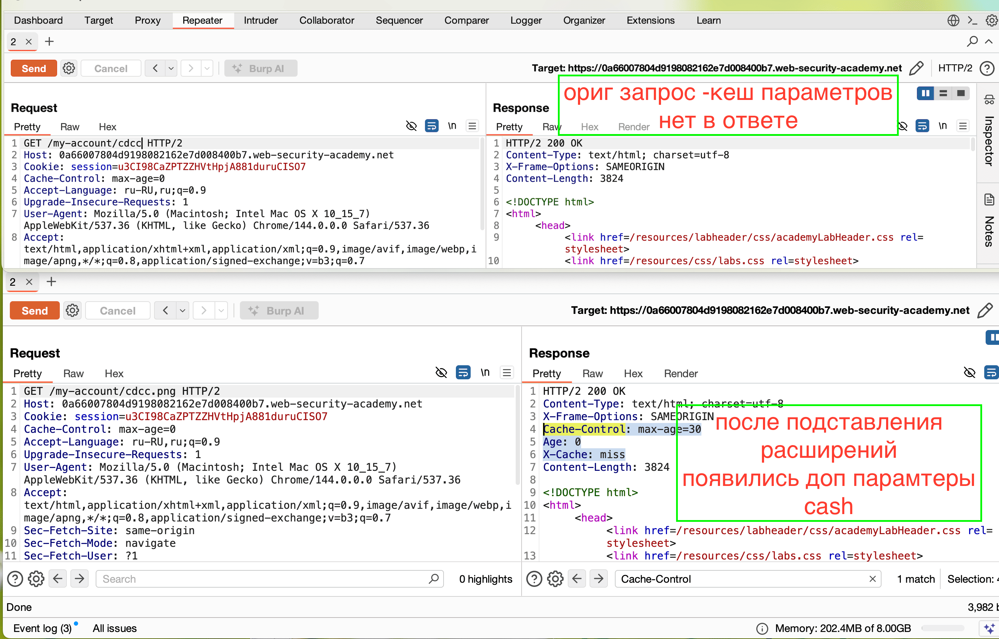

## Описание теста

- > тест проверяет, корректно ли приложение обрабатывает несуществующие пути и не допускает ли ошибок в конфигурации маршрутизации
- 
- Суть в том, что если пути настроены неправильно, злоумышленник может заставить сервер или кеш (например, CDN) обработать запрос не так, как ожидалось. Классический пример - это атака **Web Cache Deception**, когда злоумышленник заставляет CDN закешировать страницу с чувствительными данными, маскируя её под статический файл

- этот тест, чтобы найти ошибки в маршрутизации, которые могут привести к утечке данных через кеширование. Если разработчик использует неправильные регулярные выражения для определения путей, злоумышленник может получить доступ к странице с личными данными, подставив в URL несуществующий путь, и заставить кеш сохранить эту страницу, чтобы потом её прочитать

##  Цели теста

1. **Выявить несоответствия в обработке путей** (когда приложение показывает один и тот же контент по разным URL)
   
2. **Проверить корректность регулярных выражений** в конфигурации маршрутов
   
3. **Оценить риск атак Web Cache Deception**
--------


##  Как выполнять тест 

### Шаг 1: Поиск страниц с чувствительными данными

Сначала я определяю страницы, которые содержат чувствительные данные пользователя: дашборды, личные кабинеты, страницы настроек профиля, баланс счета и т.д.

### Шаг 2: Подстановка несуществующих путей

Для каждой найденной страницы (например, `/user/dashboard`) я пробую добавить к пути несуществующий сегмент, который выглядит как статический файл:

- `/user/dashboard/none.js`
   
- `/user/dashboard/none.css`
   
- `/user/dashboard/none.jpg`
   
- `/user/dashboard/none.json`



для реализации этой уязвимости достаточно иметь собственный сайт, на котором разместить такой скрипт и отправить ссылку на сайт жертве:
скрипт который просто выполняет переход по ссылке! и данные уходят в кеш CDN
```html

<script>document.location="https://0a66007804d9198082162e7d008400b7.web-security-academy.net/my-account/wcd.js"</script>
```

в логах на сайте я вижу, что кто-то зашел на мой сайт, значит у меня есть 30 сек, чтобы перейти по этой же ссылке и получить копию данные того чела, что первым перешел по ссылке.


отправив ссылку жертве и перейдя по ней - я получил данные карлоса. лаба решена!


лабы тут [[1_WCD_]] и смежные...

-----


**Что я смотрю:**

- Если страница загружается и показывает те же данные (баланс, имя пользователя), что и `/user/dashboard`, значит приложение не проверяет, существует ли запрошенный ресурс
   
- Если при этом используется CDN, это может быть уязвимость к Web Cache Deception


---------------


### Шаг 3: Проверка обработки несуществующих путей

Я также проверяю, как сервер реагирует на явно несуществующие пути:

- `/random-path-that-does-not-exist`
   
- `/user/dashboard/random-path`
   

**Что я смотрю:**

- Возвращается ли `404 Not Found` (правильно) без доп инфы
 
- Возвращается ли `200 OK` с содержимым (ошибка маршрутизации)

---------

###  Анализ кода (White-box)

Если у меня есть доступ к исходному коду, я ищу конфигурацию маршрутов. Частая ошибка - использование слишком широких регулярных выражений:

**Неправильно (Django):**
```python
re_path(r'.*^dashboard', views.path_confusion, name='index')
```
Этот паттерн перехватит любой запрос, содержащий "dashboard" в любом месте, включая `/dashboard/none.js`, и отдаст данные дашборда


**Правильно:**
```python
path('dashboard/', views.dashboard, name='dashboard')
```

Или более строгое регулярное выражение

-----------


-
### Шаг 5: Проверка кеширования через заголовки

Если я подозреваю, что CDN или прокси кеширует контент, я проверяю заголовки ответа:

- ❌ `Cache-Control: public, max-age=...` - контент может быть закеширован
   
- ✅ `Cache-Control: private` - кеширование запрещено

----------


## Интерпретация результатов

**Что считать успехом (находкой):**

- Страница с личными данными доступна по пути с "мусорным" сегментом (например, `/dashboard/none.js`)
   
- Приложение не возвращает `404 Not Found` на несуществующие пути, а показывает реальный контент
   
- Найден код с неправильными регулярными выражениями для маршрутов
   
- Заголовки кеширования позволяют кешировать чувствительные данные
   

**Как я документирую:**

- Путь, по которому доступна страница с данными
   
- Какой путь должен быть защищён
   
- Пример подстановки, которая работает
   
- Потенциальное воздействие (например, "кеширование личных данных в CDN приводит к их утечке")
   
- Рекомендации: исправить регулярные выражения, использовать `Cache-Control: private`, правильно обрабатывать `404`

---------


##  Пример атаки Web Cache Deception

1. Приложение имеет страницу `/account/balance`, которая показывает остаток на счете
   
2. Приложение и CDN настроены так, что все запросы к статическим файлам (`.js`, `.css`) кешируются
   
3. Злоумышленник отправляет жертве ссылку: `https://example.com/account/balance/random.js`
   
4. Если приложение неправильно обрабатывает пути, оно показывает содержимое `/account/balance`, а CDN кеширует этот ответ как `random.js`
   
5. Злоумышленник затем запрашивает `https://example.com/account/balance/random.js` и получает закешированную страницу с чужим балансом
   

##  Важные нюансы

1. **Этот тест тесно связан с Web Cache Deception.** Если ты подозреваешь, что атака возможна, нужно проверить кеширование через заголовки и поведение CDN
   
2. **Путаница путей может быть не только в веб-фреймворках.** Она может возникать и на уровне веб-сервера (конфигурация Nginx, Apache) при неправильной обработке URL
   
3. **Проверяй не только GET, но и POST-запросы.** Иногда проблема воспроизводится только с определённым методом
   

---