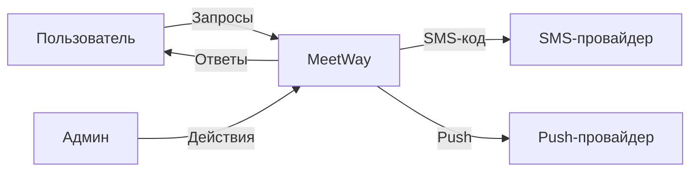

# DFD – Диаграммы потоков данных: полное руководство

Версия: 1.0 | Дата: 04.08.2026 | Назначение: рабочее руководство по построению DFD (все уровни) для threat modeling и проектирования

---

## Часть 1. Теория

### 1.1. Что такое DFD

**DFD (Data Flow Diagram)** – диаграмма потоков данных. Показывает, **как данные движутся через систему**: откуда приходят, через какие процессы проходят, где хранятся и куда уходят.

Это НЕ блок-схема (flowchart) и НЕ UML-диаграмма последовательности. DFD:
- Показывает **данные и их движение** (что течёт)
- НЕ показывает **время, порядок, условия** (когда, в каком порядке)
- НЕ показывает **управление** (какие решения принимаются)

Главное назначение в безопасности: DFD – **основа для threat modeling** (моделирования угроз). Нарисовал DFD → увидел trust boundaries и потоки данных → по каждому потоку прогнал STRIDE → нашёл угрозы.

### 1.2. Элементы DFD (нотация)

Используются две основные нотации: **Yourdon/DeMarco** и **Gane-Sarson**. Смысл одинаковый, отличаются формы. Ниже – Yourdon/DeMarco (самая популярная).

| Элемент                                | Символ                 | Что означает                                                       | Пример имени                      |
| -------------------------------------- | ---------------------- | ------------------------------------------------------------------ | --------------------------------- |
| **Process (процесс)**                  | Круг                   | Преобразует данные (функция, модуль, сервис)                       | «Проверить логин», «Создать пост» |
| **Data Store (хранилище)**             | Две параллельные линии | Данные в покое: БД, файлы, кэш, очередь                            | D1: Пользователи, D2: Посты       |
| **External Entity (внешняя сущность)** | Прямоугольник          | Источник/приёмник данных ВНЕ системы: пользователь, другая система | «Пользователь», «Платёжный шлюз»  |
| **Data Flow (поток)**                  | Стрелка с подписью     | Данные в движении между элементами                                 | «Запрос логина», «Список постов»  |

Правила имён:
- **Процессы** – глаголы: «Проверить», «Сохранить», «Отправить»
- **Потоки и хранилища** – существительные: «Данные профиля», «Журнал аудита»
- **Внешние сущности** – существительные: «Пользователь», «Админ»

### 1.3. Trust boundaries (границы доверия)

**Trust boundary** – пунктирная линия, разделяющая зоны с разным уровнем доверия: клиент | сервер | БД | сторонний сервис. Всё, что пересекает границу, – потенциальная точка атаки. Для безопасности DFD рисуется С trust boundaries, и каждый поток, пересекающий границу, проверяется по STRIDE.

Примеры границ: «Интернет ↔ сервер», «Сервер ↔ БД», «Приложение ↔ сторонний API».

### 1.4. Уровни DFD

DFD строится по уровням детализации – от общего к частному (top-down):

| Уровень                             | Что показывает                                                           | Кто смотрит               |
| ----------------------------------- | ------------------------------------------------------------------------ | ------------------------- |
| **Level 0 (контекстная диаграмма)** | Вся система как ОДИН процесс + внешние сущности вокруг + основные потоки | Стейкхолдеры, менеджмент  |
| **Level 1**                         | Основные процессы (обычно 4-9) + хранилища данных + потоки между ними    | Архитекторы, разработчики |
| **Level 2**                         | Детализация одного процесса Level 1 на подпроцессы                       | Команда разработки        |
| **Level 3+**                        | Ещё более глубокая детализация (редко нужна)                             | Только при сложной логике |

Правило: **детализируй только то, что важно**. Уровень 3+ обычно избыточен для threat modeling.

### 1.5. Нумерация процессов

- Level 0: единственный процесс = вся система (обычно без номера или «0»)
- Level 1: процессы 1.0, 2.0, 3.0...
- Level 2: подпроцессы 1.1, 1.2, 2.1... (дочерние для 1.0)
- Level 3: 1.1.1, 1.1.2...

Хранилища нумеруются D1, D2, D3... Внешние сущности – E1, E2... или просто по имени.

### 1.6. Правила построения DFD (обязательные)

1. **Каждый процесс** должен иметь минимум **1 вход** и **1 выход** данных.
2. **Потоки не могут идти**:
   - между двумя хранилищами напрямую (данные должны пройти через процесс)
   - между двумя внешними сущностями напрямую (обмен идёт через систему)
   - из хранилища во внешнюю сущность напрямую (только через процесс)
3. **Балансировка уровней**: входы и выходы дочерней диаграммы (Level 2) должны **совпадать** с потоками родительского процесса (Level 1). Что входит в процесс 1.0, то входит и в его детализацию.
4. **Именование**: поток подписывается именем данных, которые он несёт (не «стрелка», а «Данные профиля»).
5. **Хранилище** рисуется только если данные **покоятся** (БД, файл, кэш). Временная передача данных (например, параметры функции) – это поток, не хранилище.
6. **Контекстная диаграмма** – ровно один процесс, никаких хранилищ.
7. Данные не могут «течь назад» без процесса-преобразователя.

---

## Часть 2. Пошаговое построение DFD

### Шаг 0. Подготовка

1. Определи **цель**: для чего диаграмма (threat modeling, документация, онбординг).
2. Определи **границы системы**: что внутри (наша разработка), что снаружи (сторонние сервисы).
3. Собери **источники**: требования (SRS), архитектурные заметки, интервью с командой, существующие схемы.
4. Выбери **инструмент** (список в Части 4).


| Инструмент | Где | Особенности |
|---|---|---|
| **draw.io (diagrams.net)** | Браузер/десктоп, бесплатно | Лучший выбор: шаблоны, экспорт в PNG/SVG/XML |
| **Excalidraw** | В Obsidian (плагин), бесплатно | Удобно прямо в заметках, есть стрелки и прямоугольники |
| **Mermaid** | В Obsidian нативно (```mermaid) | Кодом: быстро, версионируется в git, но для сложных DFD тесновато |
| **PlantUML** | Текст → картинка | Кодом, хорош для автоматизации |
| **Lucidchart** | Онлайн, есть free-тариф | Красиво, совместная работа |
| **Microsoft Visio** | Windows/десктоп | Классика, платно |
| **StarUML** | Десктоп | UML + DFD |


### Шаг 1. Контекстная диаграмма (Level 0)

1. Нарисуй **один большой процесс** в центре – вся система (например, «MeetWay»).
2. Определи **всех внешних сущностей** вокруг: кто даёт данные системе и кто получает:
   - Пользователь (iOS/Android клиент)
   - Админ/модератор
   - Сторонние сервисы (SMS-провайдер, push-провайдер, платёжный шлюз)
   - Внешние API (если есть)
3. Проведи **основные потоки** между сущностями и системой (НЕ детализируй внутренности).
4. Подпиши потоки существительными: «Запрос регистрации», «Уведомление», «Платёж».

**Результат:** картинка «кто с кем общается» – понятная даже менеджеру.

### Шаг 2. Level 1 – основные процессы

1. Разбей систему на **основные процессы** (по бизнес-функциям, обычно 4-9):
   - Регистрация/аутентификация
   - Управление профилем
   - Посты и лента
   - Чаты
   - Поиск
   - Модерация/админка
2. Добавь **хранилища данных** (D1, D2...):
   - D1: Пользователи, D2: Профили, D3: Посты, D4: Сообщения, D5: Медиафайлы, D6: Аудит-лог
3. Соедини **потоками**: внешние сущности → процессы → хранилища.
4. Проверь **балансировку** с Level 0: все внешние потоки контекстной диаграммы должны появиться на Level 1 (войти в соответствующие процессы).

### Шаг 3. Trust boundaries

1. Обведи пунктиром зоны доверия:
   - TB-1: Клиент (не доверяем)
   - TB-2: Сервер/API (наша зона)
   - TB-3: Хранилища (только внутренняя сеть)
   - TB-4: Сторонние сервисы (внешние)
2. Пометь, какие потоки **пересекают границы** – именно они будут анализироваться на угрозы.

### Шаг 4. Level 2 – детализация

1. Выбери процесс, который требует детализации (обычно самые критичные: аутентификация, авторизация, платежи).
2. Нарисуй **подпроцессы** (например, процесс «Аутентификация» 1.0 → 1.1 Проверка пароля, 1.2 Выдача токена, 1.3 Управление сессией).
3. Добавь хранилища, используемые подпроцессами.
4. **Проверь балансировку**: входы/выходы дочерней диаграммы = входы/выходы родительского процесса 1.0.
5. Повторяй для других процессов, только если нужно.

### Шаг 5. Проверка и валидация

Прогони чек-лист из Части 5, покажи диаграмму команде (архитектору, разработчикам), исправь замечания.

### Шаг 6. Использование в threat modeling

1. Для **каждого потока данных** (особенно пересекающего trust boundary) прогони **STRIDE**:
   - Spoofing: можно ли подделать отправителя?
   - Tampering: можно ли изменить данные в пути?
   - Repudiation: можно ли отрицать действие?
   - Information Disclosure: можно ли прочитать чужие данные?
   - DoS: можно ли нарушить доступность?
   - Elevation of Privilege: можно ли повысить права?
2. Для каждого хранилища – те же вопросы (защита at rest, доступ).
3. Результаты → реестр угроз (THR) → требования безопасности (SEC).

---

## Часть 3. Пример: DFD для MeetWay

### Level 0 (контекстная диаграмма)

```text
         ┌───────────────┐   Запросы/данные    ┌──────────────────────┐
         │  Пользователь │ ──────────────────▶ │                      │
         │  (iOS/Android)│ ◀────────────────── │                      │
         └───────────────┘   Ответы/контент    │       MeetWay        │
                                              │   (вся система)      │
         ┌───────────────┐   Админ-действия    │                      │
         │  Админ        │ ──────────────────▶ │                      │
         └───────────────┘ ◀────────────────── │                      │
                                              └──────────┬───────────┘
         ┌───────────────┐                              │
         │ SMS-провайдер │ ◀────────── Код верификации ─┘
         └───────────────┘
         ┌───────────────┐
         │ Push-провайдер│ ◀────────── Push-уведомление ─┘
         └───────────────┘
```

### Level 1 (основные процессы)

```text
                        ┌──────────────────────────────────────────────┐
   Пользователь ──────▶ │ 1.0 Регистрация/аутентификация              │ ───▶ D1: Пользователи
                        └──────────────────────────────────────────────┘
                        ┌──────────────────────────────────────────────┐
   Пользователь ◀────── │ 2.0 Управление профилем                      │ ◀───▶ D2: Профили
                        └──────────────────────────────────────────────┘
                        ┌──────────────────────────────────────────────┐
   Пользователь ◀─────▶ │ 3.0 Посты и лента                            │ ◀───▶ D3: Посты
                        └──────────────────────────────────────────────┘          │
                                                                                   ▼
                        ┌──────────────────────────────────────────────┐    D5: Медиа (S3)
   Пользователь ◀─────▶ │ 4.0 Чаты и сообщения                         │ ◀───▶ D4: Сообщения
                        └──────────────────────────────────────────────┘
                        ┌──────────────────────────────────────────────┐
   Пользователь ──────▶ │ 5.0 Поиск                                    │ ◀───▶ D2: Профили
                        └──────────────────────────────────────────────┘
                        ┌──────────────────────────────────────────────┐
   Админ ──────────────▶ │ 6.0 Модерация/админка                        │ ───▶ D6: Аудит-лог
                        └──────────────────────────────────────────────┘
```

**Trust boundaries:**
- TB-1: Пользователь ↔ API (потоки: запросы, ответы) – здесь: TLS, JWT, валидация
- TB-2: API ↔ Хранилища (D1-D6) – здесь: только внутренняя сеть, IAM
- TB-3: API ↔ SMS/Push-провайдеры – здесь: ключи в Lockbox, TLS
- TB-4: Админ ↔ Админка – здесь: 2FA, RBAC, аудит

### Level 2 (пример: процесс 1.0 Аутентификация)

```text
   Пользователь ──Запрос логина──▶ 1.1 Проверка пароля (argon2id) ──▶ D1: Пользователи
                                        │
                                        ▼
                                  1.2 Выдача JWT access/refresh
                                        │
                                        ▼
                                  1.3 Управление сессией (ротация refresh) ──▶ D7: Сессии
                                        │
                                        ▼
   Пользователь ◀──Токены + ответ─── (выход процесса 1.0)
```

Балансировка: вход процесса 1.0 = «Запрос логина» от пользователя; выход = «Токены + ответ». На Level 2 те же входы/выходы присутствуют – баланс соблюдён.

---

## Часть 4. Инструменты для DFD

| Инструмент | Где | Особенности |
|---|---|---|
| **draw.io (diagrams.net)** | Браузер/десктоп, бесплатно | Лучший выбор: шаблоны, экспорт в PNG/SVG/XML |
| **Excalidraw** | В Obsidian (плагин), бесплатно | Удобно прямо в заметках, есть стрелки и прямоугольники |
| **Mermaid** | В Obsidian нативно (```mermaid) | Кодом: быстро, версионируется в git, но для сложных DFD тесновато |
| **PlantUML** | Текст → картинка | Кодом, хорош для автоматизации |
| **Lucidchart** | Онлайн, есть free-тариф | Красиво, совместная работа |
| **Microsoft Visio** | Windows/десктоп | Классика, платно |
| **StarUML** | Десктоп | UML + DFD |

Совет: для работы в Obsidian – **Excalidraw** (рисуешь мышкой) или **Mermaid** (кодом). Для отчётов/документации – **draw.io** (экспорт в PNG для вставки).

Пример Mermaid-DFD (Level 0):



---

## Часть 5. Чек-лист проверки DFD

- [ ] Контекстная диаграмма (Level 0): один процесс, все внешние сущности, основные потоки
- [ ] Каждый процесс имеет минимум 1 вход и 1 выход
- [ ] Нет потоков: хранилище→хранилище, сущность→сущность, хранилище→сущность напрямую
- [ ] Хранилища пронумерованы (D1, D2...), процессы нумерованы по уровням (1.0, 1.1...)
- [ ] Все потоки подписаны существительными (что за данные)
- [ ] Балансировка: Level 2 повторяет входы/выходы процессов Level 1
- [ ] Trust boundaries нарисованы и подписаны (TB-1, TB-2...)
- [ ] Потоки, пересекающие границы, помечены (кандидаты для STRIDE)
- [ ] Диаграмма согласована с архитектором/командой
- [ ] Версия и дата указаны (диаграмма живёт и меняется)

---

## Часть 6. Как DFD встраивается в SSDLC

DFD – обязательный артефакт **этапа 4 Design** (в твоём комплекте документов это `Security_Design_MeetWay_v1.0.md`, раздел 4). Порядок:

1. **Requirements** – собрали требования (SEC)
2. **Analysis** – оценили риски (реестр RSK)
3. **Planning** – спланировали
4. **Design** – нарисовали DFD → trust boundaries → **threat modeling (STRIDE)** → реестр угроз THR
5. **Development** – реализуем с учётом THR
6. **Testing** – проверяем угрозы из THR
7. **Deployment/Maintenance** – обновляем DFD при изменениях архитектуры

Правило: **изменилась архитектура → обновился DFD → перепрогнали STRIDE**. DFD – живой документ, а не картинка «на сдачу».

---

*Полное руководство по DFD. Используется для threat modeling и проектирования; примеры адаптируй под свой проект.*
